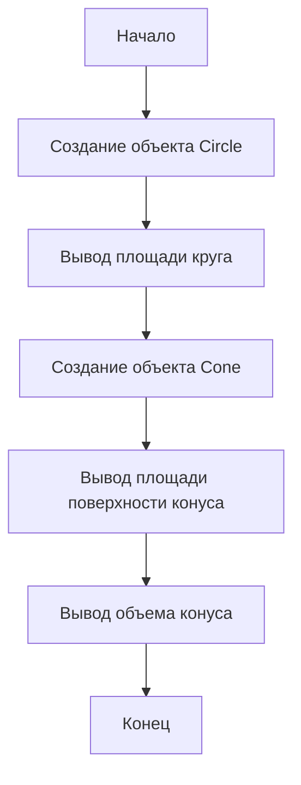
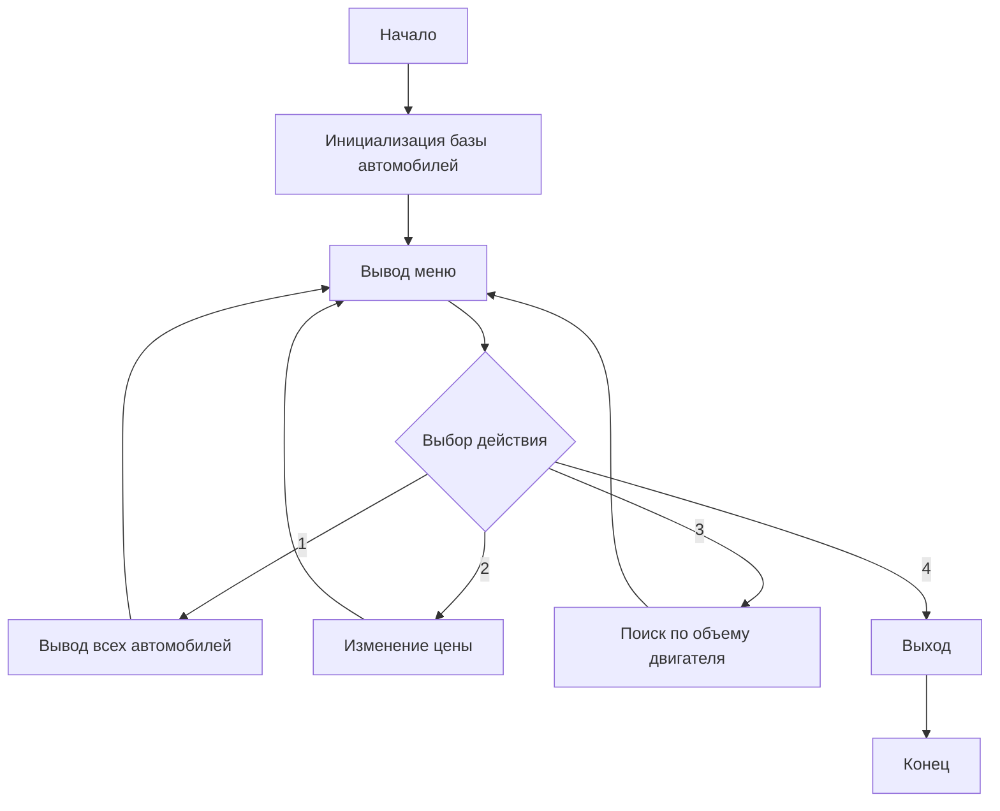
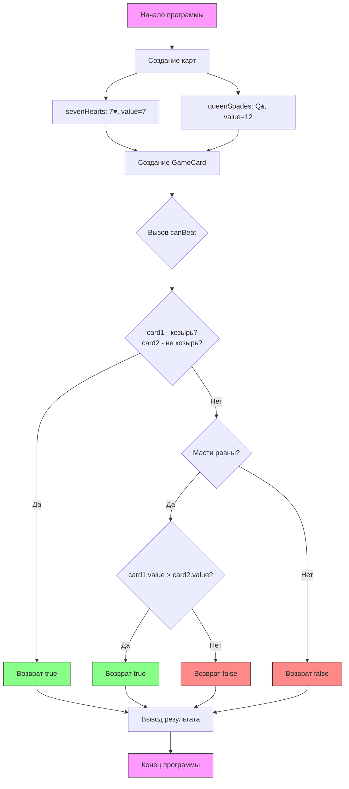
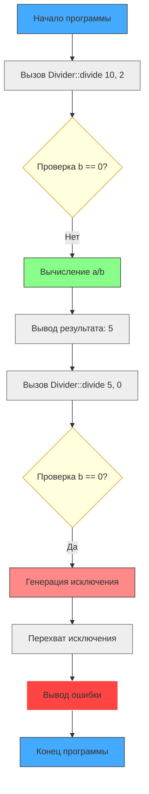

## Задание 1

```
#include <iostream>
#include <cmath>
#include <iomanip>
using namespace std;

class Circle {
protected:
    double x, y; // Координаты центра
    double radius;
public:
    Circle(double x, double y, double r) : x(x), y(y), radius(r) {}
    ~Circle() {}

    double area() const {
        return M_PI * radius * radius;
    }

    void printInfo() const {
        cout << "Окружность с центром в (" << x << ", " << y << "), радиус = " << radius << endl;
        cout << "Площадь круга: " << fixed << setprecision(2) << area() << endl;
    }
};

class Cone : public Circle {
private:
    double z; // Координата вершины конуса
public:
    Cone(double x, double y, double r, double z) : Circle(x, y, r), z(z) {}
    ~Cone() {}

    double surfaceArea() const {
        double l = sqrt(radius * radius + z * z); // Образующая
        return M_PI * radius * (radius + l);
    }

    double volume() const {
        return (1.0 / 3.0) * area() * abs(z);
    }

    void printInfo() const {
        Circle::printInfo();
        cout << "Конус с вершиной в (" << x << ", " << y << ", " << z << ")" << endl;
        cout << "Площадь поверхности: " << fixed << setprecision(2) << surfaceArea() << endl;
        cout << "Объем: " << fixed << setprecision(2) << volume() << endl;
    }
};

int main() {
    // Пример работы с окружностью
    Circle circle(1.0, 2.0, 3.0);
    circle.printInfo();

    cout << "\n";

    // Пример работы с конусом
    Cone cone(1.0, 2.0, 3.0, 5.0);
    cone.printInfo();

    return 0;
}
```
### Вывод:
```
Окружность с центром в (1, 2), радиус = 3
Площадь круга: 28.27

Окружность с центром в (1.00, 2.00), радиус = 3.00
Площадь круга: 28.27
Конус с вершиной в (1.00, 2.00, 5.00)
Площадь поверхности: 83.23
Объем: 47.12
```
### Блок схема:



## Задание 33
```
#include <iostream>
#include <vector>
#include <algorithm>
#include <limits>
using namespace std;

struct Car {
    string brand;
    string country;
    int year;
    double engineVolume;
    double fuelConsumption;
    double price;
    int quantity;
};

vector<Car> cars = {
    {"Toyota Camry", "Japan", 2022, 2.5, 7.8, 30000, 5},
    {"BMW X5", "Germany", 2021, 3.0, 9.2, 65000, 3},
    {"Ford Focus", "USA", 2020, 1.6, 6.4, 20000, 7},
    {"Kia Rio", "Korea", 2023, 1.4, 5.7, 18000, 10},
    {"Audi A6", "Germany", 2022, 3.0, 8.1, 55000, 2},
    {"Lada Vesta", "Russia", 2021, 1.8, 8.5, 12000, 15},
    {"Hyundai Tucson", "Korea", 2023, 2.0, 7.3, 28000, 4},
    {"Volkswagen Golf", "Germany", 2020, 1.4, 6.0, 22000, 6}
};

void printCar(const Car& car) {
    cout << "Марка: " << car.brand << "\n";
    cout << "Страна: " << car.country << "\n";
    cout << "Год: " << car.year << "\n";
    cout << "Объем двигателя: " << car.engineVolume << " л\n";
    cout << "Расход топлива: " << car.fuelConsumption << " л/100км\n";
    cout << "Цена: $" << car.price << "\n";
    cout << "Количество: " << car.quantity << " шт.\n";
    cout << "----------------------------\n";
}

void printAllCars() {
    cout << "\n=== Список всех автомобилей ===\n";
    for (const auto& car : cars) {
        printCar(car);
    }
}

void updatePrice() {
    string brand;
    cout << "Введите марку автомобиля для изменения цены: ";
    getline(cin, brand);

    auto it = find_if(cars.begin(), cars.end(), [&brand](const Car& car) {
        return car.brand == brand;
    });

    if (it != cars.end()) {
        double newPrice;
        cout << "Текущая цена: $" << it->price << "\n";
        cout << "Введите новую цену: ";
        cin >> newPrice;
        cin.ignore();
        it->price = newPrice;
        cout << "Цена обновлена!\n";
    } else {
        cout << "Автомобиль не найден!\n";
    }
}

void findBestByVolume() {
    double volume;
    cout << "Введите объем двигателя (л): ";
    cin >> volume;
    cin.ignore();

    vector<Car> filtered;
    copy_if(cars.begin(), cars.end(), back_inserter(filtered), [volume](const Car& car) {
        return car.engineVolume == volume;
    });

    if (filtered.empty()) {
        cout << "Автомобили с объемом " << volume << " л не найдены.\n";
        return;
    }

    auto bestCar = min_element(filtered.begin(), filtered.end(), [](const Car& a, const Car& b) {
        return a.fuelConsumption < b.fuelConsumption;
    });

    cout << "\nЛучший автомобиль с объемом " << volume << " л:\n";
    printCar(*bestCar);
}

void showMenu() {
    cout << "\n=== Меню управления ===\n";
    cout << "1. Показать все автомобили\n";
    cout << "2. Изменить цену автомобиля\n";
    cout << "3. Найти автомобиль по объему двигателя\n";
    cout << "4. Выход\n";
    cout << "Выберите действие: ";
}

int main() {
    int choice;
    do {
        showMenu();
        cin >> choice;
        cin.ignore(); // Очистка буфера после ввода числа

        switch (choice) {
            case 1:
                printAllCars();
                break;
            case 2:
                updatePrice();
                break;
            case 3:
                findBestByVolume();
                break;
            case 4:
                cout << "Выход из программы.\n";
                break;
            default:
                cout << "Неверный выбор. Попробуйте снова.\n";
        }
    } while (choice != 4);

    return 0;
}
```
### Вывод:
```
=== Меню управления ===
1. Показать все автомобили
2. Изменить цену автомобиля
3. Найти автомобиль по объему двигателя
4. Выход
Выберите действие: 2
Введите марку автомобиля для изменения цены: Toyota Camry
Текущая цена: $30000
Введите новую цену: 28000
Цена обновлена!

=== Меню управления ===
1. Показать все автомобили
2. Изменить цену автомобиля
3. Найти автомобиль по объему двигателя
4. Выход
Выберите действие: 1

=== Список всех автомобилей ===
Марка: Toyota Camry
Страна: Japan
Год: 2022
Объем двигателя: 2.5 л
Расход топлива: 7.8 л/100км
Цена: $28000
Количество: 5 шт.
----------------------------
Марка: BMW X5
Страна: Germany
Год: 2021
Объем двигателя: 3 л
Расход топлива: 9.2 л/100км
Цена: $65000
Количество: 3 шт.
----------------------------
Марка: Ford Focus
Страна: USA
Год: 2020
Объем двигателя: 1.6 л
Расход топлива: 6.4 л/100км
Цена: $20000
Количество: 7 шт.
----------------------------
Марка: Kia Rio
Страна: Korea
Год: 2023
Объем двигателя: 1.4 л
Расход топлива: 5.7 л/100км
Цена: $18000
Количество: 10 шт.
----------------------------
Марка: Audi A6
Страна: Germany
Год: 2022
Объем двигателя: 3 л
Расход топлива: 8.1 л/100км
Цена: $55000
Количество: 2 шт.
----------------------------
Марка: Lada Vesta
Страна: Russia
Год: 2021
Объем двигателя: 1.8 л
Расход топлива: 8.5 л/100км
Цена: $12000
Количество: 15 шт.
----------------------------
Марка: Hyundai Tucson
Страна: Korea
Год: 2023
Объем двигателя: 2 л
Расход топлива: 7.3 л/100км
Цена: $28000
Количество: 4 шт.
----------------------------
Марка: Volkswagen Golf
Страна: Germany
Год: 2020
Объем двигателя: 1.4 л
Расход топлива: 6 л/100км
Цена: $22000
Количество: 6 шт.
----------------------------

=== Меню управления ===
1. Показать все автомобили
2. Изменить цену автомобиля
3. Найти автомобиль по объему двигателя
4. Выход
Выберите действие: 
```
### Блок схема:







