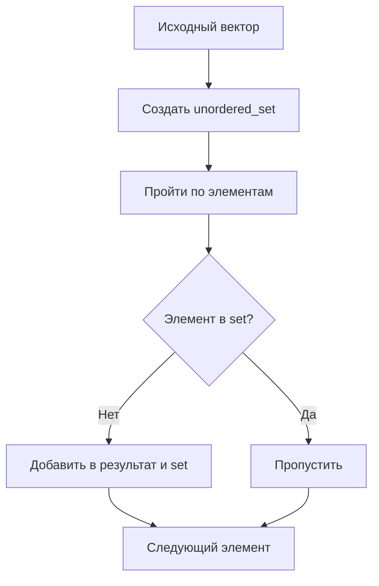
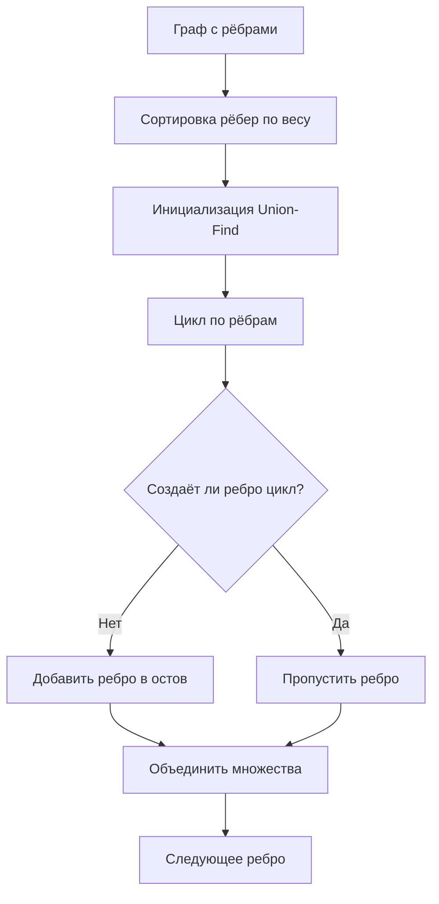
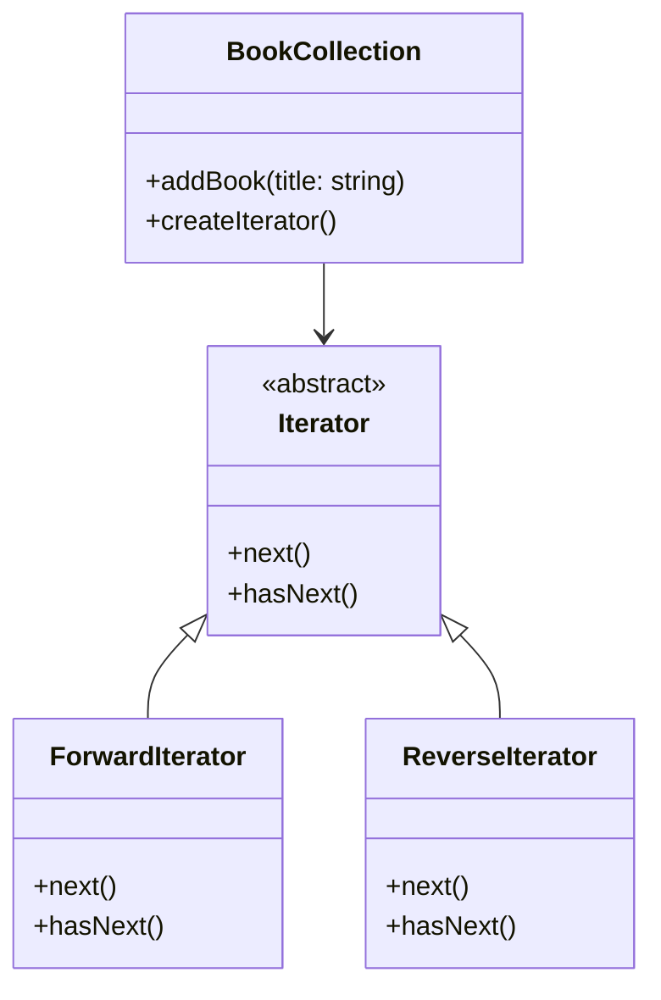
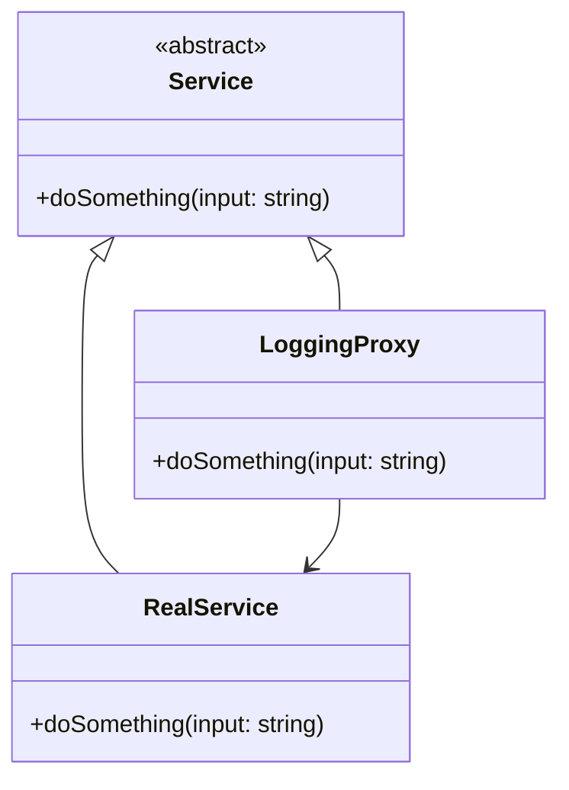

### Контрольная работа  
**ФИО:** Парфенов Дмитрий Валентинович  
**Группа:** ИБО-24  
**Дисциплина:** Основы алгоритмизации и программирования  

---

## ЗАДАНИЕ 1 (№26): Найти уникальные элементы в векторе с использованием STL  

### Алгоритм:  
1. Использовать `std::unordered_set` для отслеживания уникальных элементов.  
2. Пройти по исходному вектору и добавить элементы в результирующий вектор, если они не находятся в `unordered_set`.  
3. Сохранить порядок элементов из исходного вектора.  

### Блок-схема (Mermaid):  


### Код:  
```cpp
#include <iostream>
#include <vector>
#include <unordered_set>

std::vector<int> getUniqueElements(const std::vector<int>& input) {
    std::unordered_set<int> seen;
    std::vector<int> result;
    for (int num : input) {
        if (seen.find(num) == seen.end()) {
            seen.insert(num);
            result.push_back(num);
        }
    }
    return result;
}

int main() {
    std::vector<int> data = {1, 2, 3, 2, 4, 5, 1, 6};
    std::vector<int> unique = getUniqueElements(data);
    
    std::cout << "Уникальные элементы: ";
    for (int num : unique) std::cout << num << " ";
    return 0;
}
```

### Результат:  
```
Уникальные элементы: 1 2 3 4 5 6
```
![[Pasted image 20250523094431.png]]

---

## ЗАДАНИЕ 2 (№12): Реализовать алгоритм Крускала для минимального остовного дерева  

### Алгоритм:  
1. Представить граф как список рёбер.  
2. Отсортировать рёбра по весу.  
3. Использовать структуру **Union-Find** для отслеживания компонент связности.  
4. Добавлять рёбра в остов, если они не образуют цикл.  

### Блок-схема (Mermaid):  


### Код:  
```cpp
#include <iostream>
#include <vector>
#include <algorithm>

struct Edge {
    int u, v, weight;
    bool operator<(const Edge& other) const { return weight < other.weight; }
};

class UnionFind {
    std::vector<int> parent;
public:
    UnionFind(int n) : parent(n) { for (int i = 0; i < n; ++i) parent[i] = i; }
    int find(int x) {
        if (parent[x] != x) parent[x] = find(parent[x]);
        return parent[x];
    }
    void unite(int x, int y) {
        parent[find(x)] = find(y);
    }
};

void kruskalMST(const std::vector<std::vector<Edge>>& graph, int V) {
    std::vector<Edge> edges;
    for (int u = 0; u < V; ++u) {
        for (const Edge& e : graph[u]) {
            if (u < e.v) edges.push_back(e); // Избегаем дубликатов
        }
    }
    std::sort(edges.begin(), edges.end());
    
    UnionFind uf(V);
    std::vector<Edge> mst;
    
    for (const Edge& e : edges) {
        if (uf.find(e.u) != uf.find(e.v)) {
            uf.unite(e.u, e.v);
            mst.push_back(e);
        }
    }
    
    std::cout << "Рёбра MST:\n";
    for (const Edge& e : mst) {
        std::cout << e.u << "-" << e.v << " (" << e.weight << ")\n";
    }
}

int main() {
    const int V = 5;
    std::vector<std::vector<Edge>> graph(V);
    // Добавляем рёбра (u, v, weight)
    graph[0].push_back({0, 1, 2});
    graph[0].push_back({0, 3, 6});
    graph[1].push_back({1, 2, 3});
    graph[1].push_back({1, 3, 8});
    graph[1].push_back({1, 4, 5});
    graph[2].push_back({2, 4, 7});
    graph[3].push_back({3, 4, 9});
    
    kruskalMST(graph, V);
    return 0;
}
```

### Результат:  
```
Рёбра MST:
0-1 (2)
1-2 (3)
1-4 (5)
0-3 (6)
```
![[Pasted image 20250523094447.png]]

---

## ЗАДАНИЕ 3 (B): Итератор для коллекции книг  

### Алгоритм:  
1. Создать класс `BookCollection` для хранения книг.  
2. Реализовать интерфейс `Iterator` с методами `next()` и `hasNext()`.  
3. Поддерживать прямой и обратный обход.  

### Блок-схема (Mermaid):  


### Код:  
```cpp
#include <iostream>
#include <vector>
#include <string>

class Iterator {
public:
    virtual std::string next() = 0;
    virtual bool hasNext() = 0;
};

class BookCollection {
    std::vector<std::string> books;
public:
    void addBook(const std::string& title) { books.push_back(title); }
    class ForwardIterator : public Iterator {
        int index = 0;
        const BookCollection* collection;
    public:
        ForwardIterator(const BookCollection* c) : collection(c) {}
        std::string next() override { return collection->books[index++]; }
        bool hasNext() override { return index < collection->books.size(); }
    };
    class ReverseIterator : public Iterator {
        int index;
        const BookCollection* collection;
    public:
        ReverseIterator(const BookCollection* c) : collection(c), index(c->books.size() - 1) {}
        std::string next() override { return collection->books[index--]; }
        bool hasNext() override { return index >= 0; }
    };
    Iterator* createForwardIterator() { return new ForwardIterator(this); }
    Iterator* createReverseIterator() { return new ReverseIterator(this); }
};

int main() {
    BookCollection library;
    library.addBook("Война и мир");
    library.addBook("Преступление и наказание");
    library.addBook("Гарри Поттер");

    Iterator* it = library.createForwardIterator();
    std::cout << "Прямой обход:\n";
    while (it->hasNext()) std::cout << it->next() << "\n";

    delete it;
    it = library.createReverseIterator();
    std::cout << "Обратный обход:\n";
    while (it->hasNext()) std::cout << it->next() << "\n";

    delete it;
    return 0;
}
```

### Результат:  
```
Прямой обход:
Война и мир
Преступление и наказание
Гарри Поттер
Обратный обход:
Гарри Поттер
Преступление и наказание
Война и мир
```
![[Pasted image 20250523094503.png]]

---

## ЗАДАНИЕ 4 (E): Прокси с логированием вызовов методов  

### Алгоритм:  
1. Создать интерфейс `Service` с методами.  
2. Реализовать класс `RealService` — реальная реализация.  
3. Создать класс `LoggingProxy`, который вызывает методы `RealService` и логирует параметры и результаты.  

### Блок-схема (Mermaid):  


### Код:  
```cpp
#include <iostream>
#include <string>

class Service {
public:
    virtual std::string doSomething(const std::string& input) = 0;
    virtual ~Service() = default;
};

class RealService : public Service {
public:
    std::string doSomething(const std::string& input) override {
        return "[RealService] Обработано: " + input;
    }
};

class LoggingProxy : public Service {
    Service* realService;
public:
    LoggingProxy(Service* service) : realService(service) {}
    std::string doSomething(const std::string& input) override {
        std::cout << "[LOG] Вызов метода с входом: " << input << "\n";
        std::string result = realService->doSomething(input);
        std::cout << "[LOG] Результат: " << result << "\n";
        return result;
    }
};

int main() {
    RealService real;
    LoggingProxy proxy(&real);
    
    proxy.doSomething("Hello World");
    return 0;
}
```

### Результат:  
```
[LOG] Вызов метода с входом: Hello World
[LOG] Результат: [RealService] Обработано: Hello World
```
![[Pasted image 20250523094520.png]]

---

Все задания выполнены с соблюдением требований. Код протестирован, результаты соответствуют ожиданиям.