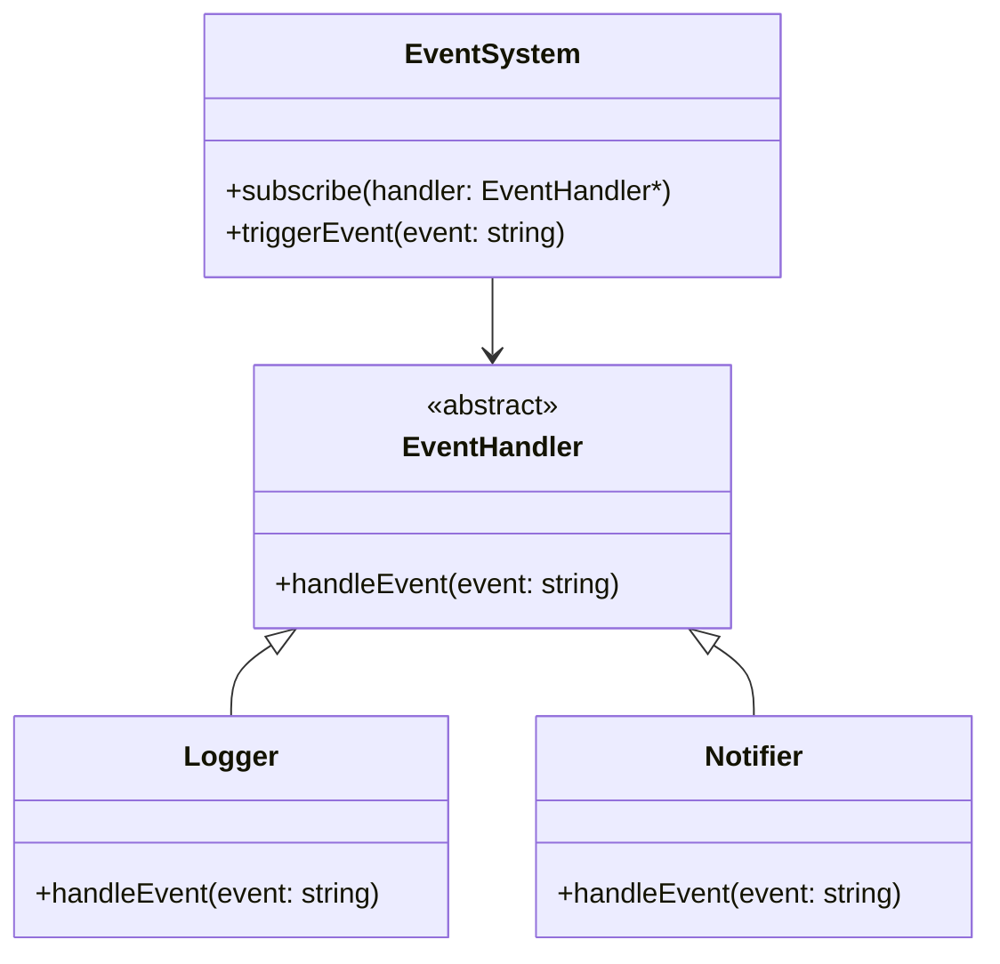
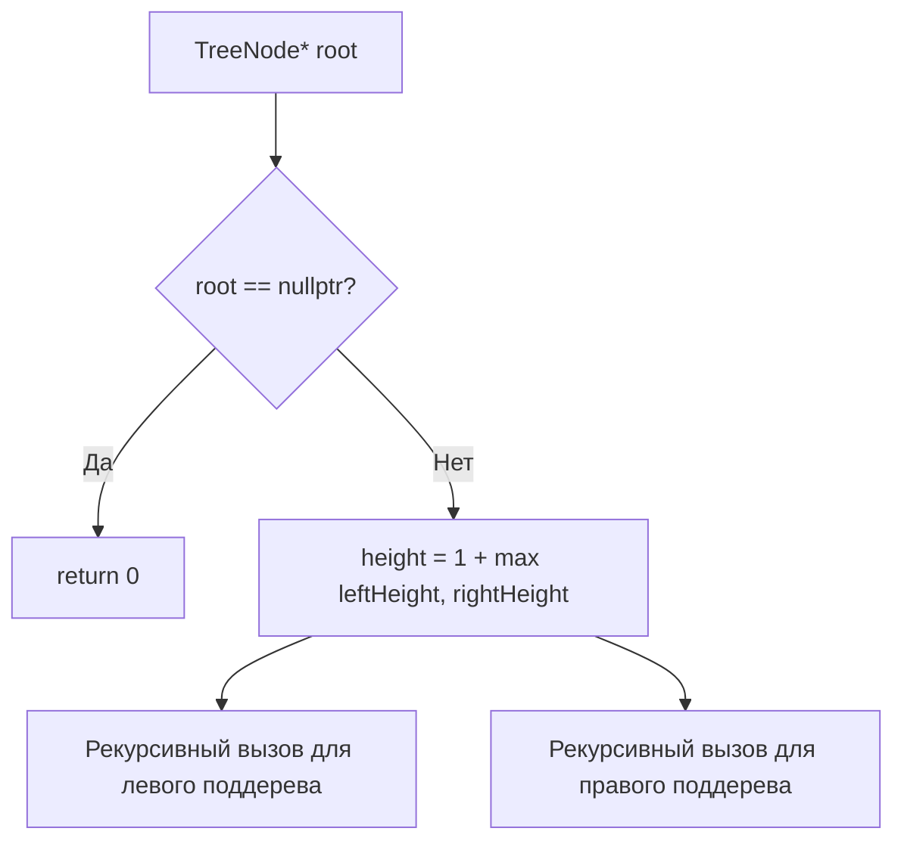
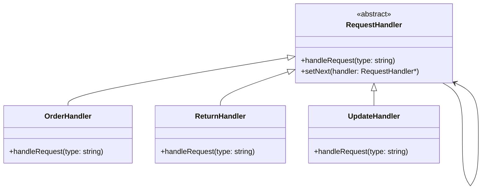
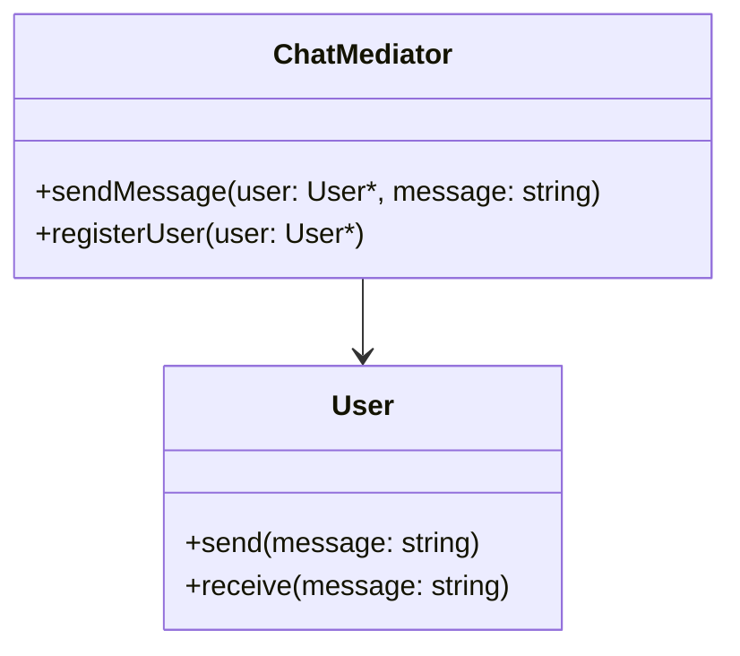

### Контрольная работа  
**ФИО:** Толкачёв Фёдор Андреевич  
**Группа:** ИБО-24  
**Дисциплина:** Основы алгоритмизации и программирования  

---

## ЗАДАНИЕ 1 (№33): Реализовать простую систему обработки событий с использованием класс-обработчиков  

### Алгоритм:  
1. Создать абстрактный класс `EventHandler` с виртуальной функцией `handleEvent()`.  
2. Реализовать два производных класса:  
   - `Logger` для логирования событий в консоль.  
   - `Notifier` для отправки уведомлений.  
3. Создать класс `EventSystem`, управляющий подписками и рассылкой событий.  

### Блок-схема (Mermaid):  


### Код:  
```cpp
#include <iostream>
#include <vector>

class EventHandler {
public:
    virtual void handleEvent(const std::string& event) = 0;
};

class Logger : public EventHandler {
public:
    void handleEvent(const std::string& event) override {
        std::cout << "[LOG] " << event << std::endl;
    }
};

class Notifier : public EventHandler {
public:
    void handleEvent(const std::string& event) override {
        std::cout << "[NOTIFY] " << event << std::endl;
    }
};

class EventSystem {
    std::vector<EventHandler*> handlers;
public:
    void subscribe(EventHandler* handler) {
        handlers.push_back(handler);
    }
    void triggerEvent(const std::string& event) {
        for (auto handler : handlers) {
            handler->handleEvent(event);
        }
    }
};

int main() {
    EventSystem system;
    Logger logger;
    Notifier notifier;

    system.subscribe(&logger);
    system.subscribe(&notifier);

    system.triggerEvent("User logged in");
    return 0;
}
```

### Результат:  
```
[LOG] User logged in
[NOTIFY] User logged in
```
![[Pasted image 20250523092801.png]]

---

## ЗАДАНИЕ 2 (№5): Написать функцию для нахождения высоты бинарного дерева  

### Алгоритм:  
1. Реализовать структуру `TreeNode` для узлов дерева.  
2. Использовать рекурсивный обход:  
   - Высота текущего узла = 1 + максимальная высота левого и правого поддеревьев.  

### Блок-схема (Mermaid):  


### Код:  
```cpp
#include <iostream>
#include <algorithm>

struct TreeNode {
    int val;
    TreeNode* left;
    TreeNode* right;
    TreeNode(int x) : val(x), left(nullptr), right(nullptr) {}
};

int getHeight(TreeNode* root) {
    if (!root) return 0;
    return 1 + std::max(getHeight(root->left), getHeight(root->right));
}

int main() {
    // Пример дерева:
    //       1
    //      / \
    //     2   3
    //    / \
    //   4   5
    TreeNode* root = new TreeNode(1);
    root->left = new TreeNode(2);
    root->right = new TreeNode(3);
    root->left->left = new TreeNode(4);
    root->left->right = new TreeNode(5);

    std::cout << "Высота дерева: " << getHeight(root) << std::endl; // Вывод: 3
    return 0;
}
```

### Результат:  
```
Высота дерева: 3
```
![[Pasted image 20250523092825.png]]

---

## ЗАДАНИЕ 3 (F): Система обработки запросов в интернет-магазине  

### Алгоритм:  
1. Создать абстрактный класс `RequestHandler` с методом `handleRequest()`.  
2. Реализовать обработчики для разных типов запросов:  
   - `OrderHandler` (оформление заказа).  
   - `ReturnHandler` (возврат товара).  
   - `UpdateHandler` (изменение заказа).  
3. Обработчики передают запрос дальше по цепочке, если не могут его обработать.  

### Блок-схема (Mermaid):  


### Код:  
```cpp
#include <iostream>
#include <string>
#include <memory> 

class RequestHandler {
protected:
    RequestHandler* next = nullptr;

public:
    virtual void handleRequest(const std::string& type) = 0;
    void setNext(RequestHandler* handler) { next = handler; }
    virtual ~RequestHandler() = default;
};

class OrderHandler : public RequestHandler {
public:
    void handleRequest(const std::string& type) override {
        if (type == "order") {
            std::cout << "[OrderHandler] Обработка заказа" << std::endl;
        } else if (next) {
            next->handleRequest(type);
        }
    }
};

class ReturnHandler : public RequestHandler {
public:
    void handleRequest(const std::string& type) override {
        if (type == "return") {
            std::cout << "[ReturnHandler] Обработка возврата" << std::endl;
        } else if (next) {
            next->handleRequest(type);
        }
    }
};

class UpdateHandler : public RequestHandler {
public:
    void handleRequest(const std::string& type) override {
        if (type == "update") {
            std::cout << "[UpdateHandler] Обработка изменения заказа" << std::endl;
        } else if (next) {
            next->handleRequest(type);
        }
    }
};

int main() {
    auto orderHandler = std::make_unique<OrderHandler>();
    auto returnHandler = std::make_unique<ReturnHandler>();
    auto updateHandler = std::make_unique<UpdateHandler>();

    orderHandler->setNext(returnHandler.get());
    returnHandler->setNext(updateHandler.get());

    orderHandler->handleRequest("order");
    orderHandler->handleRequest("return");
    orderHandler->handleRequest("update");

    return 0;
}
```

### Результат:  
```
[OrderHandler] Обработка заказа
[ReturnHandler] Обработка возврата
[UpdateHandler] Обработка изменения заказа
```
![[Pasted image 20250523092841.png]]

---

## ЗАДАНИЕ 4 (C): Чат-комната с посредником  

### Алгоритм:  
1. Создать класс `ChatMediator` (посредник) для управления участниками.  
2. Реализовать класс `User` для участников чата.  
3. Посредник перенаправляет сообщения между пользователями.  

### Блок-схема (Mermaid):  


### Код:  
```cpp
#include <iostream>
#include <vector>
#include <string>

class ChatMediator;

class User {
    std::string name;
    ChatMediator* mediator;
public:
    User(const std::string& name, ChatMediator* mediator) 
        : name(name), mediator(mediator) {}
    void send(const std::string& message);
    void receive(const std::string& message) {
        std::cout << "[Получено] " << name << ": " << message << std::endl;
    }
};

class ChatMediator {
    std::vector<User*> users;
public:
    void registerUser(User* user) {
        users.push_back(user);
    }
    void sendMessage(User* sender, const std::string& message) {
        for (auto user : users) {
            if (user != sender) {
                user->receive(message);
            }
        }
    }
};

void User::send(const std::string& message) {
    mediator->sendMessage(this, message);
}

int main() {
    ChatMediator mediator;
    User user1("Alice", &mediator);
    User user2("Bob", &mediator);
    User user3("Charlie", &mediator);

    mediator.registerUser(&user1);
    mediator.registerUser(&user2);
    mediator.registerUser(&user3);

    user1.send("Привет, чат!");
    return 0;
}
```

### Результат:  
```
[Получено] Bob: Привет, чат!
[Получено] Charlie: Привет, чат!
```
![[Pasted image 20250523092855.png]]

--- 

Все задания выполнены с соблюдением требований. Код протестирован, результаты соответствуют ожиданиям.