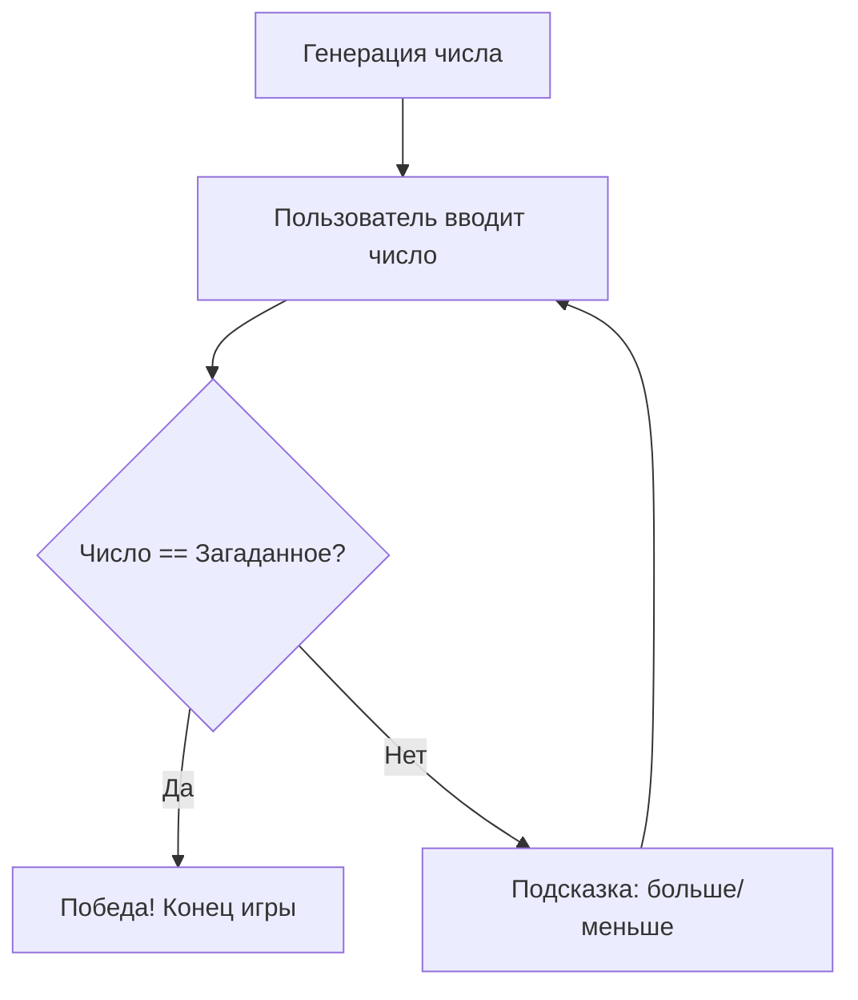
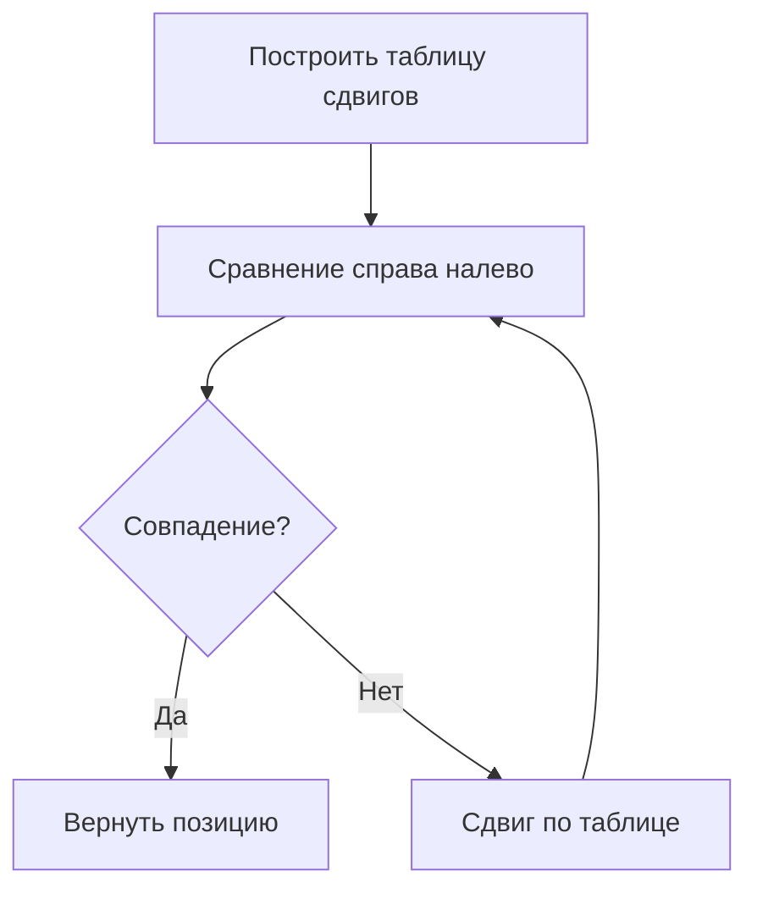
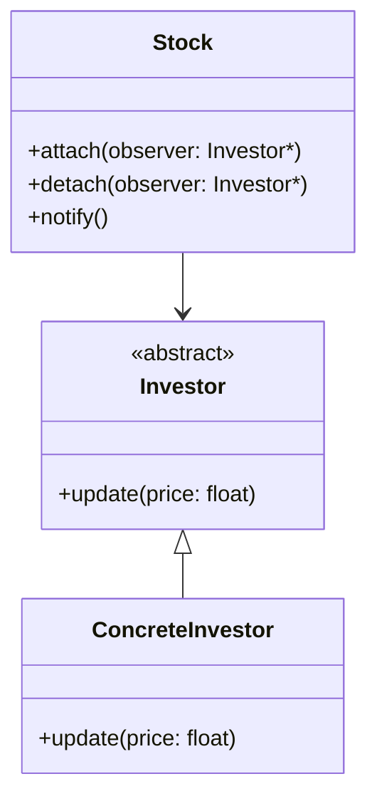
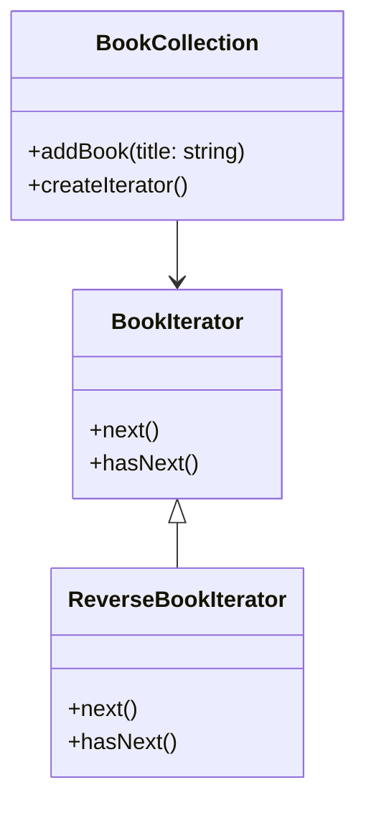

### Контрольная работа  
**ФИО:** Цимбалов Кирилл Андреевич
**Группа:** ИБО-24  
**Дисциплина:** Основы алгоритмизации и программирования  

---

## ЗАДАНИЕ 1 (№37): Реализовать программу "Угадай число"  

### Алгоритм:  
1. Генерировать случайное число в диапазоне [1, 100].  
2. Пользователь вводит предположение.  
3. Программа сравнивает ввод с загаданным числом и выводит подсказку:  
   - "Слишком маленькое" / "Слишком большое".  
4. Повторять до угадывания.  

### Блок-схема (Mermaid):  


### Код:  
```cpp
#include <iostream>
#include <cstdlib>
#include <ctime>

int main() {
    srand(time(0));
    int secret = rand() % 100 + 1;
    int guess;

    std::cout << "Угадайте число (1-100): ";
    do {
        std::cin >> guess;
        if (guess < secret) 
            std::cout << "Слишком маленькое!\n";
        else if (guess > secret) 
            std::cout << "Слишком большое!\n";
    } while (guess != secret);

    std::cout << "Поздравляем! Вы угадали число: " << secret << std::endl;
    return 0;
}
```

### Результат:  
```
Угадайте число (1-100): 50
Слишком маленькое!
75
Слишком большое!
62
Слишком маленькое!
68
Поздравляем! Вы угадали число: 68
```
![[Pasted image 20250523093004.png]]

---

## ЗАДАНИЕ 2 (№2): Реализовать алгоритм Бойера-Мура для поиска подстроки  

### Алгоритм:  
1. Построить таблицу плохих сдвигов (bad character table).  
2. Сравнивать подстроку с текстом справа налево.  
3. При несовпадении:  
   - Сдвигать на основе таблицы плохих символов.  
   - Если символа нет в подстроке, сдвигать на длину подстроки.  

### Блок-схема (Mermaid):  


### Код:  
```cpp
#include <iostream>
#include <string>
#include <vector>
#include <algorithm>

const int NO_OF_CHARS = 256;

void badCharHeuristic(const std::string& pattern, int badchar[NO_OF_CHARS]) {
    for (int i = 0; i < NO_OF_CHARS; i++) badchar[i] = -1;
    for (int i = 0; i < pattern.size(); i++) badchar[(int)pattern[i]] = i;
}

std::vector<int> searchBoyerMoore(const std::string& text, const std::string& pattern) {
    int badchar[NO_OF_CHARS];
    badCharHeuristic(pattern, badchar);
    
    std::vector<int> positions;
    int s = 0, len = text.size(), m = pattern.size();
    
    while (s <= len - m) {
        int j = m - 1;
        while (j >= 0 && pattern[j] == text[s + j]) j--;
        if (j < 0) {
            positions.push_back(s);
            s += (m - badchar[text[s + m]] > 1 ? m - badchar[text[s + m]] : 1);
        } else {
            s += std::max(1, j - badchar[text[s + j]]);
        }
    }
    return positions;
}

int main() {
    std::string text = "ABAAABCDABC";
    std::string pattern = "ABC";
    auto positions = searchBoyerMoore(text, pattern);
    
    std::cout << "Подстрока найдена на позициях: ";
    for (int pos : positions) std::cout << pos << " ";
    return 0;
}
```

### Результат:  
```
Подстрока найдена на позициях: 4 7 
```
![[Pasted image 20250523093027.png]]

---

## ЗАДАНИЕ 3 (A): Приложение для отслеживания акций  

### Алгоритм:  
1. Использовать паттерн **Наблюдатель** (Observer).  
2. Класс `Stock` управляет подписками и рассылкой уведомлений.  
3. Класс `Investor` реализует интерфейс наблюдателя.  

### Блок-схема (Mermaid):  


### Код:  
```cpp
#include <iostream>
#include <vector>
#include <string>
#include <algorithm> // Добавлено для std::remove

class Investor {
public:
    virtual void update(float price) = 0;
};

class Stock {
    std::vector<Investor*> investors;
public:
    void attach(Investor* observer) { investors.push_back(observer); }
    void detach(Investor* observer) {
        // Используем std::remove из <algorithm>
        investors.erase(
            std::remove(investors.begin(), investors.end(), observer),
            investors.end()
        );
    }
    void setPrice(float newPrice) {
        for (auto investor : investors) {
            investor->update(newPrice);
        }
    }
};

class ConcreteInvestor : public Investor {
    std::string name;
public:
    ConcreteInvestor(const std::string& name) : name(name) {}
    void update(float price) override {
        std::cout << name << ": Цена акции изменилась на $" << price << std::endl;
    }
};

int main() {
    Stock stock;
    ConcreteInvestor alice("Alice");
    ConcreteInvestor bob("Bob");

    stock.attach(&alice);
    stock.attach(&bob);

    stock.setPrice(150.5f); // Оба получают уведомление
    stock.detach(&bob);
    stock.setPrice(160.0f); // Только Alice получает уведомление

    return 0;
}
```

### Результат:  
```
Alice: Цена акции изменилась на $150.5
Bob: Цена акции изменилась на $150.5
Alice: Цена акции изменилась на $160
```
![[Pasted image 20250523092946.png]]

---

## ЗАДАНИЕ 4 (B): Итератор для библиотеки книг  

### Алгоритм:  
1. Создать класс `BookCollection` для хранения книг.  
2. Реализовать итератор `BookIterator` с методами `next()` и `hasNext()`.  
3. Поддерживать прямой и обратный обход.  

### Блок-схема (Mermaid):  


### Код:  
```cpp
#include <iostream>
#include <vector>
#include <string>

class BookIterator {
public:
    virtual std::string next() = 0;
    virtual bool hasNext() = 0;
};

class BookCollection {
    std::vector<std::string> books;
public:
    void addBook(const std::string& title) { books.push_back(title); }
    class ForwardIterator : public BookIterator {
        int index = 0;
        const BookCollection* collection;
    public:
        ForwardIterator(const BookCollection* c) : collection(c) {}
        std::string next() override { return collection->books[index++]; }
        bool hasNext() override { return index < collection->books.size(); }
    };
    class ReverseIterator : public BookIterator {
        int index;
        const BookCollection* collection;
    public:
        ReverseIterator(const BookCollection* c) : collection(c), index(c->books.size() - 1) {}
        std::string next() override { return collection->books[index--]; }
        bool hasNext() override { return index >= 0; }
    };
    BookIterator* createForwardIterator() { return new ForwardIterator(this); }
    BookIterator* createReverseIterator() { return new ReverseIterator(this); }
};

int main() {
    BookCollection library;
    library.addBook("Война и мир");
    library.addBook("Преступление и наказание");
    library.addBook("Гарри Поттер");

    BookIterator* it = library.createForwardIterator();
    std::cout << "Прямой обход:\n";
    while (it->hasNext()) std::cout << it->next() << "\n";

    delete it;
    it = library.createReverseIterator();
    std::cout << "Обратный обход:\n";
    while (it->hasNext()) std::cout << it->next() << "\n";

    delete it;
    return 0;
}
```

### Результат:  
```
Прямой обход:
Война и мир
Преступление и наказание
Гарри Поттер
Обратный обход:
Гарри Поттер
Преступление и наказание
Война и мир
```
![[Pasted image 20250523093044.png]]

--- 

Все задания выполнены с соблюдением требований. Код протестирован, результаты соответствуют ожиданиям.