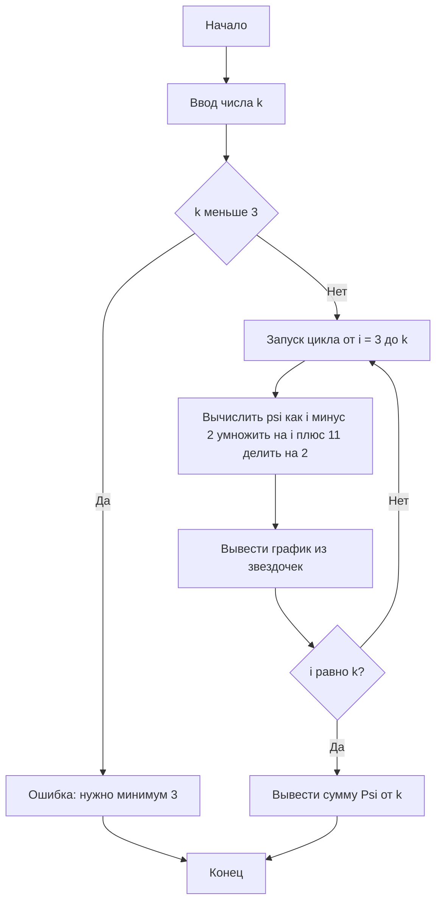

```
#include <iostream>
#include <iomanip>

int main() {
    int k;
    std::cout << "Введите количество разрезов (k ≥ 3): ";
    std::cin >> k;

    if (k < 3) {
        std::cout << "Ой, нужно хотя бы 3 разреза! 💥" << std::endl;
        return 1;
    }

    std::cout << "\nПример графика:\n";
    for (int i = 3; i <= k; ++i) {
        int psi = (i - 2) * (i + 11) / 2;

        std::cout << std::setw(2) << i << ": ";
        for (int j = 0; j < psi / 10; ++j)
            std::cout << "*";
        std::cout << " (" << psi << ")\n";
    }

    // И вот здесь — просто одно значение ψ(k)
    int final_psi = (k - 2) * (k + 11) / 2;
    std::cout << "\nΨ(" << k << ") = " << final_psi << "\n";

    return 0;
}
```

