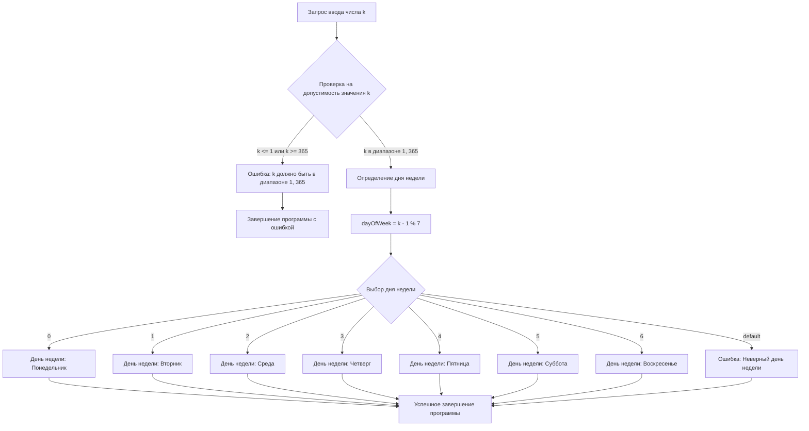
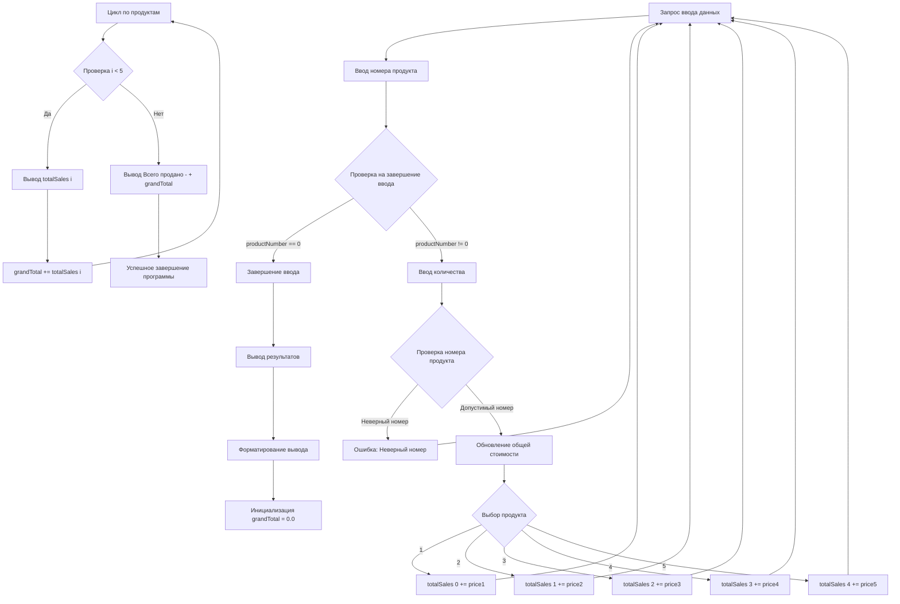
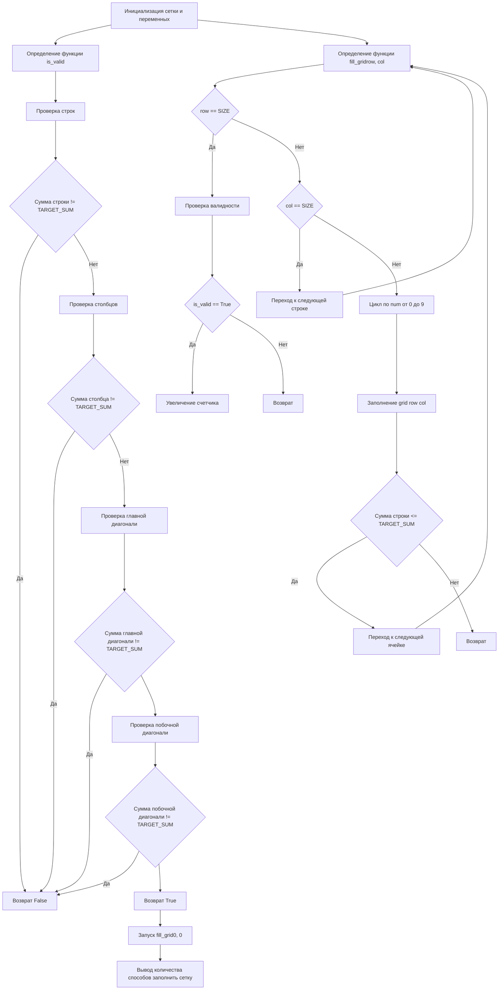

___
```
#include <iostream>

int main() {
    int k;

    // Запрос ввода числа k
    std::cout << "Введите целое число k (1 < k < 365): ";
    std::cin >> k;

    // Проверка на допустимость значения k
    if (k <= 1 || k >= 365) {
        std::cout << "Ошибка: k должно быть в диапазоне (1, 365)." << std::endl;
        return 1; // Завершение программы с ошибкой
    }

    // Определение дня недели
    int dayOfWeek = (k - 1) % 7; // k-1, чтобы 1 января было понедельником

    switch (dayOfWeek) {
        case 0:
            std::cout << "День недели: Понедельник" << std::endl;
            break;
        case 1:
            std::cout << "День недели: Вторник" << std::endl;
            break;
        case 2:
            std::cout << "День недели: Среда" << std::endl;
            break;
        case 3:
            std::cout << "День недели: Четверг" << std::endl;
            break;
        case 4:
            std::cout << "День недели: Пятница" << std::endl;
            break;
        case 5:
            std::cout << "День недели: Суббота" << std::endl;
            break;
        case 6:
            std::cout << "День недели: Воскресенье" << std::endl;
            break;
        default:
            // Этот блок не будет достигнут, так как dayOfWeek всегда будет от 0 до 6
            std::cout << "Ошибка: Неверный день недели." << std::endl;
            break;
    }

    return 0; // Успешное завершение программы
}
```

![[Pasted image 20250314095537.png]]



___

```
#include <iostream>
#include <iomanip> // Для std::setprecision

int main() {
    const double productPrices[5] = {2.98, 4.50, 9.98, 4.49, 6.87}; // Цены продуктов
    double totalSales[5] = {0.0}; // Общая стоимость продаж для каждого продукта
    int productNumber, quantity;

    // Запрос ввода данных
    std::cout << "Введите номер продукта (1-5) и количество, проданное за день (0 для завершения):" << std::endl;

    while (true) {
        std::cout << "Номер продукта: ";
        std::cin >> productNumber;

        // Проверка на завершение ввода
        if (productNumber == 0) {
            break; // Завершение ввода
        }

        std::cout << "Количество: ";
        std::cin >> quantity;

        // Проверка на допустимость номера продукта
        if (productNumber < 1 || productNumber > 5) {
            std::cout << "Ошибка: Неверный номер продукта. Пожалуйста, введите номер от 1 до 5." << std::endl;
            continue; // Переход к следующей итерации
        }

        // Определение цены и обновление общей стоимости
        switch (productNumber) {
            case 1:
                totalSales[0] += productPrices[0] * quantity;
                break;
            case 2:
                totalSales[1] += productPrices[1] * quantity;
                break;
            case 3:
                totalSales[2] += productPrices[2] * quantity;
                break;
            case 4:
                totalSales[3] += productPrices[3] * quantity;
                break;
            case 5:
                totalSales[4] += productPrices[4] * quantity;
                break;
        }
    }

    // Вывод результатов
    std::cout << std::fixed << std::setprecision(2); // Форматирование вывода
    double grandTotal = 0.0;

    for (int i = 0; i < 5; ++i) {
        std::cout << "Продукт " << (i + 1) << " -------- " << totalSales[i] << std::endl;
        grandTotal += totalSales[i];
    }

    std::cout << "Всего продано - " << grandTotal << std::endl;

    return 0; // Успешное завершение программы
}
```

![[Pasted image 20250314095639.png]]




___

```
import itertools

from tqdm import tqdm

  

N = 4

total_ways = 0

  

# Предварительно вычисляем все возможные строки с суммой target_sum

def generate_rows(target_sum):

    return [row for row in itertools.product(range(10), repeat=N) if sum(row) == target_sum]

  

def is_valid(grid, target_sum):

    # Проверяем столбцы

    for col in range(N):

        if sum(grid[row][col] for row in range(N)) != target_sum:

            return False

  

    # Проверяем главную и побочную диагонали

    if sum(grid[i][i] for i in range(N)) != target_sum:

        return False

    if sum(grid[i][N-i-1] for i in range(N)) != target_sum:

        return False

  

    return True

  

def fill_grid(target_sum):

    global total_ways

    rows = generate_rows(target_sum)

  

    # Перебираем все комбинации строк

    for grid in tqdm(itertools.product(rows, repeat=N), desc=f"Target Sum {target_sum}", leave=False):

        if is_valid(grid, target_sum):

            total_ways += 1

  

if __name__ == "__main__":

    # Перебираем все возможные целевые суммы

    for target_sum in tqdm(range(37), desc="Overall Progress"):

        fill_grid(target_sum)

  

    print("Количество способов:", total_ways)
```

![[Pasted image 20250314095729.png]]




___
