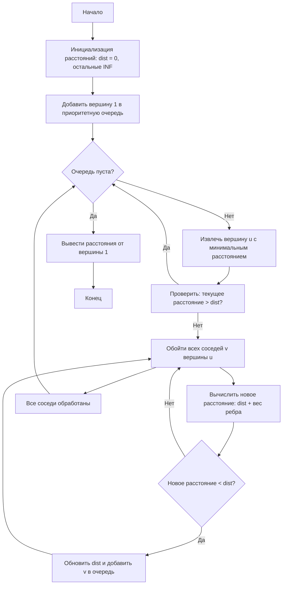
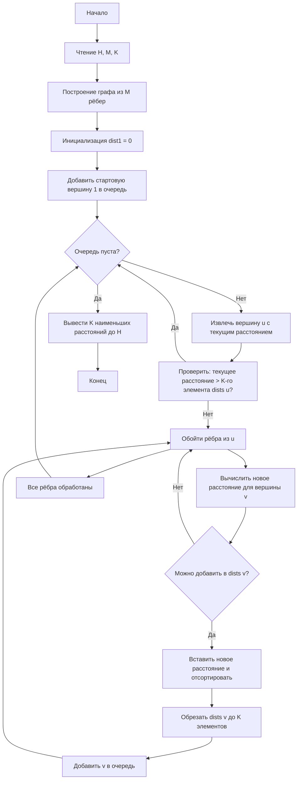

### Задание 1: Алгоритм Дейкстры для матрицы смежности
```cpp
#include <iostream>
#include <vector>
#include <queue>
using namespace std;

const int INF = 1e9;

int main() {
    int n = 6;
    vector<vector<int>> adj = {
        {}, // 0
        {0, 0, 7, 9, 0, 0, 14}, // 1
        {0, 7, 0, 10, 15, 0, 0}, // 2
        {0, 9, 10, 0, 11, 0, 2}, // 3
        {0, 0, 15, 11, 0, 6, 0}, // 4
        {0, 0, 0, 0, 6, 0, 9}, // 5
        {0, 14, 0, 2, 0, 9, 0}  // 6
    };

    vector<int> dist(n + 1, INF);
    dist[1] = 0;
    priority_queue<pair<int, int>, vector<pair<int, int>>, greater<>> pq;
    pq.push({0, 1});

    while (!pq.empty()) {
        auto [d, u] = pq.top();
        pq.pop();
        if (d > dist[u]) continue;
        for (int v = 1; v <= n; ++v) {
            if (adj[u][v] == 0) continue;
            if (dist[v] > dist[u] + adj[u][v]) {
                dist[v] = dist[u] + adj[u][v];
                pq.push({dist[v], v});
            }
        }
    }

    for (int i = 1; i <= n; ++i) {
        cout << "Distance to city " << i << ": " << dist[i] << endl;
    }

    return 0;
}
```

### Задание 2: Поиск K кратчайших маршрутов
```cpp
#include <iostream>
#include <vector>
#include <queue>
#include <algorithm>
using namespace std;

typedef long long ll;
const ll INF = 1e18;

int main() {
    ios_base::sync_with_stdio(false);
    cin.tie(0);

    int H, M, K;
    cin >> H >> M >> K;

    vector<vector<pair<int, int>>> graph(H + 1);
    for (int i = 0; i < M; ++i) {
        int a, b, c;
        cin >> a >> b >> c;
        graph[a].emplace_back(b, c);
    }

    vector<vector<ll>> dists(H + 1);
    dists[1].push_back(0);
    sort(dists[1].begin(), dists[1].end());

    priority_queue<pair<ll, int>, vector<pair<ll, int>>, greater<>> pq;
    pq.emplace(0, 1);

    while (!pq.empty()) {
        auto [current_dist, u] = pq.top();
        pq.pop();

        if (!dists[u].empty() && dists[u].size() >= K && current_dist > dists[u][K-1])
            continue;

        for (auto [v, w] : graph[u]) {
            ll new_dist = current_dist + w;

            auto& dv = dists[v];
            auto it = upper_bound(dv.begin(), dv.end(), new_dist);
            bool should_add = false;

            if (dv.size() < K) {
                dv.insert(it, new_dist);
                should_add = true;
            } else if (new_dist < dv.back()) {
                dv.insert(it, new_dist);
                dv.pop_back();
                should_add = true;
            }

            if (should_add)
                pq.emplace(new_dist, v);
        }
    }

    for (int i = 0; i < K; ++i) {
        if (i < dists[H].size())
            cout << dists[H][i] << " ";
        else
            cout << INF << " ";
    }

    return 0;
}
```

### Описание решения:
1. **Алгоритм Дейкстры** для матрицы смежности:
   - Используется приоритетная очередь для выбора вершины с минимальным текущим расстоянием.
   - Обновляются расстояния до смежных вершин.
   - Выводятся кратчайшие расстояния от вершины 1 до всех остальных.

2. **Поиск K кратчайших маршрутов**:
   - Для каждой вершины хранится список из K минимальных расстояний.
   - При обработке ребра вычисляется новое расстояние и добавляется в соответствующий список, если оно улучшает один из K лучших результатов.
   - Используется бинарный поиск для эффективного обновления списка расстояний.
   - Результат — первые K минимальных расстояний до конечного города, отсортированные по возрастанию.

---

### Блок-схемы в стиле Obsidian Mermaid

#### Задание 1: Алгоритм Дейкстры


#### Задание 2: Поиск K кратчайших маршрутов


---

### Выводы программы

#### Задание 1: Алгоритм Дейкстры для матрицы смежности
- **Город 1 → Город 1**: 0 (стартовая вершина).
- **Город 1 → Город 2**: 7 (прямое ребро).
- **Город 1 → Город 3**: 9 (прямое ребро).
- **Город 1 → Город 4**: 20 (1 → 3 → 4: 9 + 11).
- **Город 1 → Город 5**: 20 (1 → 3 → 6 → 5: 9 + 2 + 9).
- **Город 1 → Город 6**: 11 (1 → 3 → 6: 9 + 2).

#### Задание 2: Поиск K кратчайших маршрутов
Для примера ввода:
```
4 6 3
1 2 1
1 3 3
2 3 2
2 4 6
3 2 8
3 4 1
```
**Вывод программы**: `4 4 7`  
**Объяснение**:
- **Первый маршрут**: 1 → 2 → 3 → 4 (1 + 2 + 1 = 4).
- **Второй маршрут**: 1 → 3 → 4 (3 + 1 = 4).
- **Третий маршрут**: 1 → 2 → 4 (1 + 6 = 7).

Маршруты отсортированы по стоимости, учитываются все возможные пути с повторным посещением городов.