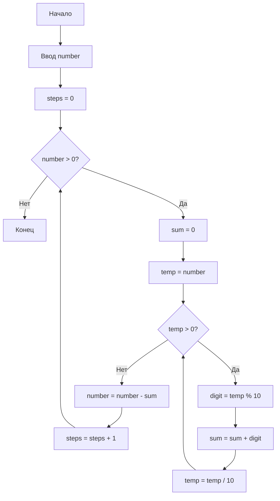
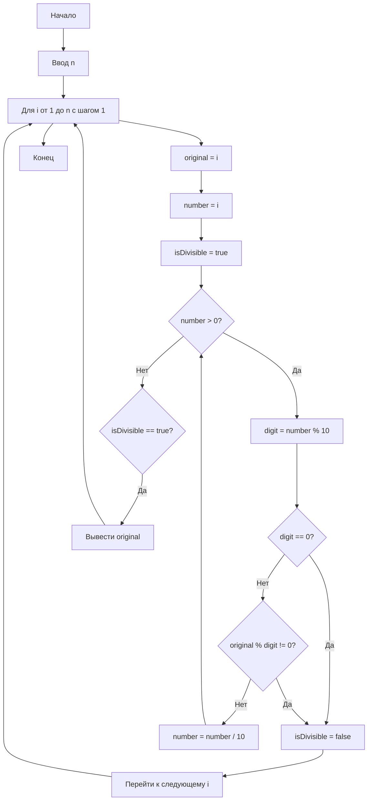

### Задача 1: Вычисление дохода по вкладу

```cpp
#include <iostream>
#include <cmath>

using namespace std;

double calculateIncomeWithoutCapitalization(double principal, double rate, int months) {
    return principal * (rate / 100) * (months / 12.0);
}

double calculateIncomeWithCapitalization(double principal, double rate, int months) {
    return principal * pow(1 + (rate / 100) / 12, months) - principal;
}

int main() {
    double principal, rate;
    int months, choice;

    cout << "Введите сумму вклада: ";
    cin >> principal;
    cout << "Введите процентную ставку (% годовых): ";
    cin >> rate;
    cout << "Введите срок вклада (в месяцах): ";
    cin >> months;

    cout << "Выберите вариант (1 - без капитализации, 2 - с капитализацией): ";
    cin >> choice;

    if (choice == 1) {
        double income = calculateIncomeWithoutCapitalization(principal, rate, months);
        cout << "Доход по вкладу без капитализации: " << income << endl;
    } else if (choice == 2) {
        double income = calculateIncomeWithCapitalization(principal, rate, months);
        cout << "Доход по вкладу с капитализацией: " << income << endl;
    } else {
        cout << "Неверный выбор." << endl;
    }

    return 0;
}
```

### Задача 2: Натуральные числа, делящиеся на каждую из своих цифр

```cpp
#include <iostream>

using namespace std;

bool isDivisibleByDigits(int number) {
    int original = number;
    while (number > 0) {
        int digit = number % 10;
        if (digit == 0 || original % digit != 0) {
            return false;
        }
        number /= 10;
    }
    return true;
}

int main() {
    int n;
    cout << "Введите натуральное число n: ";
    cin >> n;

    cout << "Числа, не превосходящие " << n << ", которые делятся на каждую из своих цифр:" << endl;
    for (int i = 1; i <= n; ++i) {
        if (isDivisibleByDigits(i)) {
            cout << i << " ";
        }
    }
    cout << endl;

    return 0;
}
```

### Задача 3: Вычитание суммы цифр до нуля

```cpp
#include <iostream>

using namespace std;

int sumOfDigits(int number) {
    int sum = 0;
    while (number > 0) {
        sum += number % 10;
        number /= 10;
    }
    return sum;
}

int main() {
    int number;
    cout << "Введите число: ";
    cin >> number;

    int steps = 0;
    while (number > 0) {
        number -= sumOfDigits(number);
        steps++;
    }

    cout << "Количество действий до получения нуля: " << steps << endl;

    return 0;
}
```

### Описание программ_1_:
1. **Вклад**: Программа запрашивает у пользователя сумму вклада, процентную ставку и срок вклада, затем вычисляет доход по выбранному варианту (с капитализацией или без).
2. **Делимость**: Программа находит все натуральные числа, не превосходящие заданного `n`, которые делятся на каждую из своих цифр.
3. **Вычитание суммы цифр**: Программа вычитает сумму цифр из числа до тех пор, пока не достигнет нуля, и считает количество таких действий.

### Алгоритм

1. **Ввод данных:**
   - Запросить у пользователя сумму вклада (principal).
   - Запросить у пользователя процентную ставку (rate) в процентах годовых.
   - Запросить у пользователя срок вклада (months) в месяцах.
   - Запросить у пользователя выбор варианта (1 - без капитализации, 2 - с капитализацией).

2. **Вычисление дохода:**
   - Если выбран вариант 1 (без капитализации):
     - Вычислить доход по формуле:
       \[
       \text{Доход} = \text{principal} \times \left(\frac{\text{rate}}{100}\right) \times \left(\frac{\text{months}}{12}\right)
       \]
   - Если выбран вариант 2 (с капитализацией):
     - Вычислить доход по формуле:
       \[
       \text{Доход} = \text{principal} \times \left(1 + \frac{\text{rate}}{100 \times 12}\right)^{\text{months}} - \text{principal}
       \]

3. **Вывод результата:**
   - Вывести рассчитанный доход на экран.

4. **Завершение программы.**





### Описание программ_2_:

### Алгоритм

1. **Ввод данных:**
   - Запросить у пользователя натуральное число `n`.

2. **Инициализация:**
   - Создать пустой список (или массив) для хранения чисел, которые удовлетворяют условию.

3. **Перебор чисел:**
   - Для каждого числа `i` от 1 до `n` (включительно):
     - Сохранить текущее значение `i` в переменной `original` для дальнейшего использования.
     - Создать переменную `number` и присвоить ей значение `i`.
     - Инициализировать флаг `isDivisible` как `true` (предполагаем, что число делится на все свои цифры).

4. **Проверка делимости:**
   - Пока `number` больше 0:
     - Получить последнюю цифру `digit` числа `number` (число по модулю 10).
     - Если `digit` равно 0, установить `isDivisible` в `false` и выйти из цикла (число не может делиться на 0).
     - Если `original` не делится на `digit` (проверить `original % digit != 0`), установить `isDivisible` в `false` и выйти из цикла.
     - Удалить последнюю цифру из `number` (разделить `number` на 10).

5. **Сохранение результата:**
   - Если `isDivisible` равно `true`, добавить `original` в список (или массив) чисел, которые делятся на каждую из своих цифр.

6. **Вывод результата:**
   - Вывести все найденные числа на экран.

7. **Завершение программы.**




### Алгоритм _3_

1. **Ввод данных:**
   - Запросить у пользователя целое число `number`.

2. **Инициализация:**
   - Создать переменную `steps` и установить ее значение в 0 (для подсчета количества действий).

3. **Вычитание суммы цифр:**
   - Пока `number` больше 0:
     - Вычислить сумму цифр числа `number`:
       - Создать переменную `sum` и установить ее значение в 0.
       - Создать временную переменную `temp` и присвоить ей значение `number`.
       - Пока `temp` больше 0:
         - Получить последнюю цифру `digit` (число по модулю 10).
         - Добавить `digit` к `sum`.
         - Удалить последнюю цифру из `temp` (разделить `temp` на 10).
     - Вычесть `sum` из `number`.
     - Увеличить `steps` на 1.

4. **Вывод результата:**
   - Вывести значение переменной `steps` (количество действий до получения нуля).

5. **Завершение программы.**


