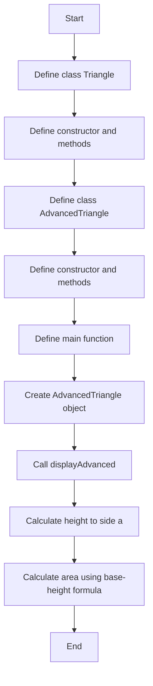
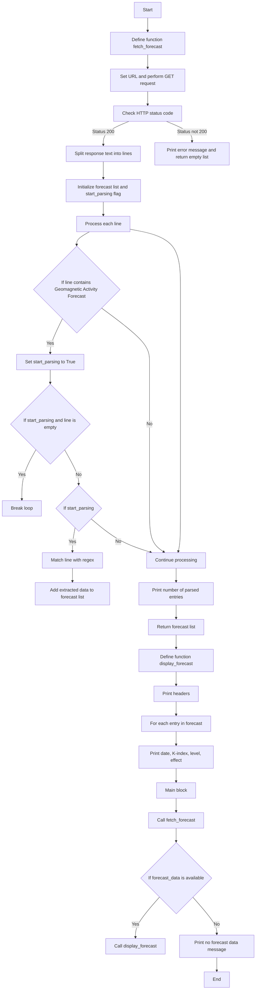
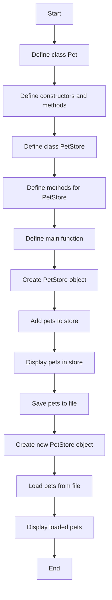

## Задача №1

---

```
#include <iostream>
#include <cmath>

class Triangle {
protected:
    double a, b, c;

public:
    Triangle(double side1, double side2, double side3) : a(side1), b(side2), c(side3) {}
    
    virtual ~Triangle() {}
    
    double getPerimeter() const {
        return a + b + c;
    }
    
    double getArea() const {
        double s = getPerimeter() / 2;
        return sqrt(s * (s - a) * (s - b) * (s - c));
    }
    
    void display() const {
        std::cout << "Perimeter: " << getPerimeter() << "\n";
        std::cout << "Area (Heron's formula): " << getArea() << "\n";
    }
};

class AdvancedTriangle : public Triangle {
public:
    AdvancedTriangle(double side1, double side2, double side3) : Triangle(side1, side2, side3) {}
    
    double getAngleA() const {
        return acos((b * b + c * c - a * a) / (2 * b * c)) * 180 / M_PI;
    }
    
    double getAngleB() const {
        return acos((a * a + c * c - b * b) / (2 * a * c)) * 180 / M_PI;
    }
    
    double getAngleC() const {
        return 180 - getAngleA() - getAngleB();
    }
    
    double getHeight(double base) const {
        return (2 * getArea()) / base;
    }
    
    double getAreaByBaseHeight(double base, double height) const {
        return 0.5 * base * height;
    }
    
    void displayAdvanced() const {
        display();
        std::cout << "Angles: A=" << getAngleA() << ", B=" << getAngleB() << ", C=" << getAngleC() << "\n";
    }
};

int main() {
    AdvancedTriangle t(3, 4, 5);
    t.displayAdvanced();
    std::cout << "Height to side a: " << t.getHeight(3) << "\n";
    std::cout << "Area using base-height formula: " << t.getAreaByBaseHeight(3, t.getHeight(3)) << "\n";
    return 0;
}

```

---
### Вывод:
```
Perimeter: 12
Area (Heron's formula): 6
Angles: A=36.8699, B=53.1301, C=90
Height to side a: 4
Area using base-height formula: 6


=== Code Execution Successful ===
```

### Алгоритм 1
```
Алгоритм
Определение класса Triangle
Поля: a, b, c (стороны треугольника)
Конструктор: инициализация сторон
Метод getPerimeter(): вычисление периметра
Метод getArea(): вычисление площади по формуле Герона
Метод display(): вывод периметра и площади
Определение класса AdvancedTriangle, наследующего от Triangle
Конструктор: инициализация сторон
Метод getAngleA(): вычисление угла A
Метод getAngleB(): вычисление угла B
Метод getAngleC(): вычисление угла C
Метод getHeight(base): вычисление высоты к основанию
Метод getAreaByBaseHeight(base, height): вычисление площади по основанию и высоте
Метод displayAdvanced(): вывод информации о треугольнике, включая углы
Функция main()
Создание объекта AdvancedTriangle
Вызов метода displayAdvanced()
Вычисление и вывод высоты к стороне a
Вычисление и вывод площади по формуле с основанием и высотой
```

---

## Задача №2

---

```
import requests
import re

def fetch_forecast():
    url = "https://services.swpc.noaa.gov/text/27-day-outlook.txt"
    response = requests.get(url)
    
    print(f"HTTP Status Code: {response.status_code}")  # Проверяем статус ответа
    
    if response.status_code != 200:
        print("Failed to retrieve data")
        return []
    
    data = response.text.split("\n")
    forecast = []
    start_parsing = False
    
    for line in data:
        print(f"Processing line: {line}")  # Выводим каждую строку для отладки
        
        if "Geomagnetic Activity Forecast" in line:
            start_parsing = True
            continue
        if start_parsing and line.strip() == "":
            break
        if start_parsing:
            match = re.match(r"(\d{4}-\d{2}-\d{2})\s+(\d+)\s+(\w+)\s+(.*)", line)
            if match:
                date, k_index, level, effect = match.groups()
                forecast.append({"date": date, "k_index": int(k_index), "level": level, "effect": effect})
    
    print(f"Parsed {len(forecast)} entries")  # Проверяем, сколько записей распарсилось
    return forecast

def display_forecast(forecast):
    print("Date | K-Index | Level | Effect")
    for entry in forecast:
        print(f"{entry['date']} | {entry['k_index']} | {entry['level']} | {entry['effect']}")

if __name__ == "__main__":
    forecast_data = fetch_forecast()
    if forecast_data:
        display_forecast(forecast_data)
    else:
        print("No forecast data available.")

```

---
### Вывод:

---

```
HTTP Status Code: 200
Processing line: :Product: 27-day Space Weather Outlook Table 27DO.txt
Processing line: :Issued: 2025 Mar 17 0140 UTC
Processing line: # Prepared by the US Dept. of Commerce, NOAA, Space Weather Prediction Center
Processing line: # Product description and SWPC contact on the Web
Processing line: # https://www.swpc.noaa.gov/content/subscription-services
Processing line: #
Processing line: #      27-day Space Weather Outlook Table
Processing line: #                Issued 2025-03-17
Processing line: #
Processing line: #   UTC      Radio Flux   Planetary   Largest
Processing line: #  Date       10.7 cm      A Index    Kp Index
Processing line: 2025 Mar 17     180          12          4
Processing line: 2025 Mar 18     180          15          4
Processing line: 2025 Mar 19     185          10          3
Processing line: 2025 Mar 20     190          10          3
Processing line: 2025 Mar 21     195           8          3
Processing line: 2025 Mar 22     200           5          2
Processing line: 2025 Mar 23     195           5          2
Processing line: 2025 Mar 24     190           5          2
Processing line: 2025 Mar 25     180          15          4
Processing line: 2025 Mar 26     165          25          5
Processing line: 2025 Mar 27     160          25          5
Processing line: 2025 Mar 28     150          15          4
Processing line: 2025 Mar 29     150           5          2
Processing line: 2025 Mar 30     160           5          2
Processing line: 2025 Mar 31     160           5          2
Processing line: 2025 Apr 01     160           5          2
Processing line: 2025 Apr 02     150           5          2
Processing line: 2025 Apr 03     150          10          3
Processing line: 2025 Apr 04     155          20          5
Processing line: 2025 Apr 05     160          35          6
Processing line: 2025 Apr 06     160          10          3
Processing line: 2025 Apr 07     160          12          4
Processing line: 2025 Apr 08     165          35          6
Processing line: 2025 Apr 09     175          40          6
Processing line: 2025 Apr 10     180          25          5
Processing line: 2025 Apr 11     180          20          5
Processing line: 2025 Apr 12     185          10          3
Processing line:
Processing line:
Parsed 0 entries
No forecast data available.
```
### Алгоритм 2
```
Определение функции fetch_forecast()
Установить URL для запроса данных.
Выполнить HTTP GET запрос к URL.
Проверить статус ответа:
Если статус не 200, вывести сообщение об ошибке и вернуть пустой список.
Разделить текст ответа на строки.
Инициализировать пустой список forecast и флаг start_parsing как False.
Обработать каждую строку:
Если строка содержит "Geomagnetic Activity Forecast", установить start_parsing в True.
Если start_parsing и строка пустая, выйти из цикла.
Если start_parsing, использовать регулярное выражение для извлечения данных (дата, K-индекс, уровень, эффект).
Добавить извлеченные данные в список forecast.
Вывести количество распарсенных записей и вернуть список forecast.
Определение функции display_forecast(forecast)
Вывести заголовки столбцов.
Для каждой записи в forecast, вывести дату, K-индекс, уровень и эффект.
Основной блок программы
Вызвать fetch_forecast() и сохранить результат в forecast_data.
Если данные прогноза доступны, вызвать display_forecast(forecast_data).
Если данных нет, вывести сообщение о недоступности данных.
```

---

## Задача №3

---

```
#include <iostream>
#include <vector>
#include <fstream>
#include <sstream>
using namespace std;

class Pet {
private:
    string type;
    string gender;
    string name;
    double price;
    int quantity;

public:
    Pet() : type(""), gender(""), name(""), price(0.0), quantity(0) {}
    Pet(string t, string g, string n, double p, int q) : type(t), gender(g), name(n), price(p), quantity(q) {}
    Pet(const Pet& other) : type(other.type), gender(other.gender), name(other.name), price(other.price), quantity(other.quantity) {}
    ~Pet() {}

    void display() const {
        cout << "Type: " << type << ", Gender: " << gender << ", Name: " << name 
             << ", Price: $" << price << ", Quantity: " << quantity << endl;
    }

    friend ostream& operator<<(ostream& os, const Pet& pet) {
        os << pet.type << "," << pet.gender << "," << pet.name << "," << pet.price << "," << pet.quantity;
        return os;
    }

    friend istream& operator>>(istream& is, Pet& pet) {
        getline(is, pet.type, ',');
        getline(is, pet.gender, ',');
        getline(is, pet.name, ',');
        is >> pet.price;
        is.ignore();
        is >> pet.quantity;
        is.ignore();
        return is;
    }
};

class PetStore {
private:
    vector<Pet> pets;

public:
    void addPet(const Pet& pet) {
        pets.push_back(pet);
    }

    void displayPets() const {
        for (const auto& pet : pets) {
            pet.display();
        }
    }

    void saveToFile(const string& filename) const {
        ofstream file(filename);
        for (const auto& pet : pets) {
            file << pet << "\n";
        }
        file.close();
    }

    void loadFromFile(const string& filename) {
        ifstream file(filename);
        if (!file) {
            cout << "File not found!\n";
            return;
        }
        pets.clear();
        Pet pet;
        while (file >> pet) {
            pets.push_back(pet);
        }
        file.close();
    }
};

int main() {
    PetStore store;
    store.addPet(Pet("Cat", "Female", "Misty", 150.0, 3));
    store.addPet(Pet("Dog", "Male", "Rex", 300.0, 2));
    
    cout << "Pets in store:" << endl;
    store.displayPets();
    
    store.saveToFile("pets.txt");
    
    PetStore newStore;
    newStore.loadFromFile("pets.txt");
    cout << "\nLoaded pets from file:" << endl;
    newStore.displayPets();
    
    return 0;
}
```

---
### Вывод:

---

```
Pets in store:
Type: Cat, Gender: Female, Name: Misty, Price: $150, Quantity: 3
Type: Dog, Gender: Male, Name: Rex, Price: $300, Quantity: 2
File not found!

Loaded pets from file:


=== Code Execution Successful ===
```

---
### Алгоритм 3
```
Определение класса Pet
Поля: type, gender, name, price, quantity.
Конструкторы:
По умолчанию: инициализация полей значениями по умолчанию.
С параметрами: инициализация полей значениями, переданными в конструктор.
Копирующий: копирование полей из другого объекта Pet.
Метод display(): вывод информации о питомце.
Перегрузка оператора << для вывода питомца в формате CSV.
Перегрузка оператора >> для ввода питомца из формата CSV.
Определение класса PetStore
Поле: pets (вектор объектов Pet).
Метод addPet(const Pet& pet): добавление питомца в магазин.
Метод displayPets(): вывод информации о всех питомцах в магазине.
Метод saveToFile(const string& filename): сохранение списка питомцев в файл.
Метод loadFromFile(const string& filename): загрузка списка питомцев из файла.
Основной блок программы
Создание объекта PetStore.
Добавление питомцев в магазин.
Вывод информации о питомцах в магазине.
Сохранение списка питомцев в файл.
Создание нового объекта PetStore.
Загрузка списка питомцев из файла.
Вывод информации о загруженных питомцах.
```
