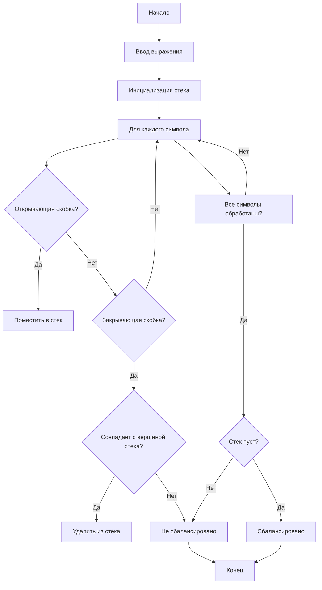
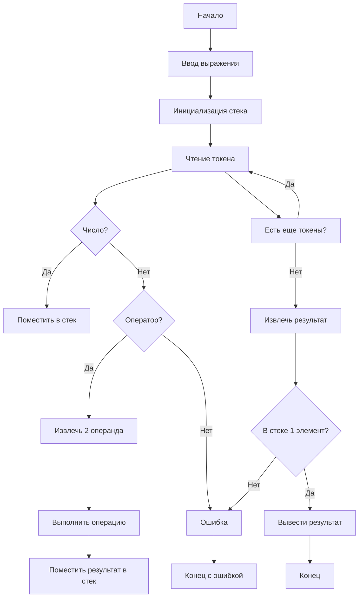
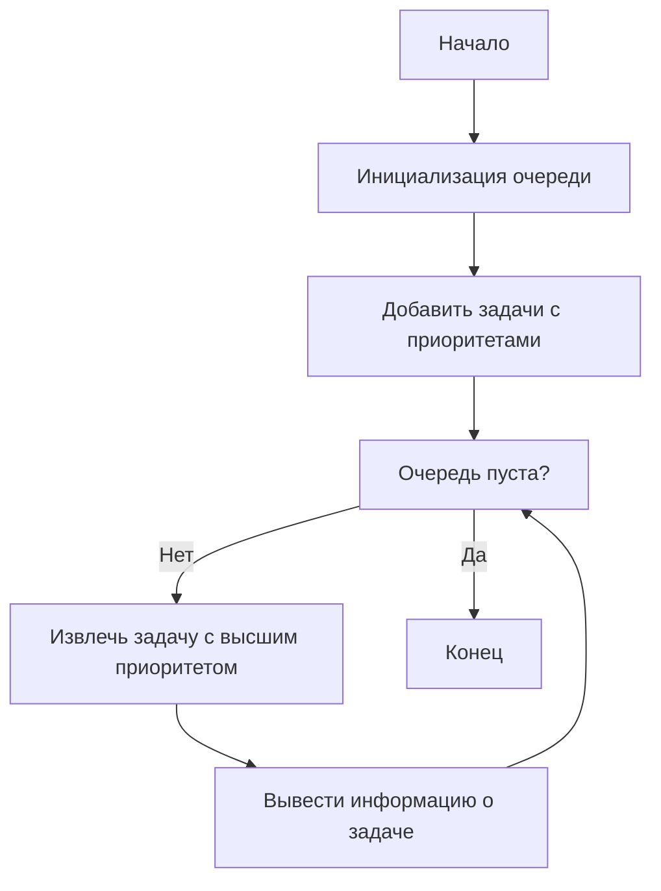
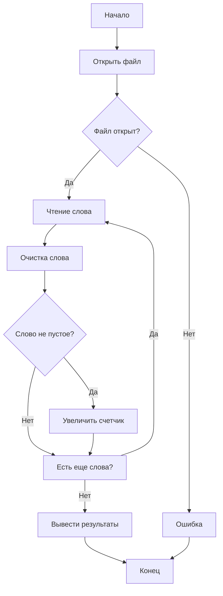

# Задание по программированию на C/C++

## 1. Проверка на сбалансированность скобок

```cpp
#include <iostream>
#include <stack>
#include <string>

bool isBalanced(const std::string& expr) {
    std::stack<char> s;
    
    for (char ch : expr) {
        switch (ch) {
            case '(': case '[': case '{':
                s.push(ch);
                break;
            case ')':
                if (s.empty() || s.top() != '(') return false;
                s.pop();
                break;
            case ']':
                if (s.empty() || s.top() != '[') return false;
                s.pop();
                break;
            case '}':
                if (s.empty() || s.top() != '{') return false;
                s.pop();
                break;
        }
    }
    
    return s.empty();
}

int main() {
    std::string expr;
    std::cout << "Введите выражение: ";
    std::getline(std::cin, expr);
    
    if (isBalanced(expr)) {
        std::cout << "Скобки сбалансированы\n";
    } else {
        std::cout << "Скобки НЕ сбалансированы\n";
    }
    
    return 0;
}
```
```
Введите выражение: ((кеек)(
Скобки НЕ сбалансированы


=== Code Execution Successful ===
```
### Блок-схема


## 2. Обратная польская запись

```cpp
#include <iostream>
#include <stack>
#include <string>
#include <sstream>
#include <stdexcept>

double evaluateRPN(const std::string& expr) {
    std::stack<double> s;
    std::istringstream iss(expr);
    std::string token;
    
    while (iss >> token) {
        if (token == "+" || token == "-" || token == "*" || token == "/") {
            if (s.size() < 2) throw std::runtime_error("Недостаточно операндов");
            double b = s.top(); s.pop();
            double a = s.top(); s.pop();
            
            if (token == "+") s.push(a + b);
            else if (token == "-") s.push(a - b);
            else if (token == "*") s.push(a * b);
            else if (token == "/") s.push(a / b);
        } else {
            s.push(std::stod(token));
        }
    }
    
    if (s.size() != 1) throw std::runtime_error("Некорректное выражение");
    return s.top();
}

int main() {
    std::string expr;
    std::cout << "Введите выражение в ОПЗ (например: 2 3 + 5 *): ";
    std::getline(std::cin, expr);
    
    try {
        double result = evaluateRPN(expr);
        std::cout << "Результат: " << result << std::endl;
    } catch (const std::exception& e) {
        std::cerr << "Ошибка: " << e.what() << std::endl;
    }
    
    return 0;
}
```
```
Введите выражение в ОПЗ (например: 2 3 + 5 *): 5 3 + 1 *
Результат: 8


=== Code Execution Successful ===
```
### Блок-схема


## 3. Расписание задач с приоритетами

```cpp
#include <iostream>
#include <queue>
#include <vector>
#include <string>

struct Task {
    std::string name;
    int priority;
    
    bool operator<(const Task& other) const {
        return priority < other.priority;
    }
};

int main() {
    std::priority_queue<Task> tasks;
    
    tasks.push({"Задача 1", 2});
    tasks.push({"Задача 2", 1});
    tasks.push({"Задача 3", 3});
    
    std::cout << "Очередь задач:\n";
    while (!tasks.empty()) {
        Task current = tasks.top();
        std::cout << current.name << " (приоритет: " << current.priority << ")\n";
        tasks.pop();
    }
    
    return 0;
}
```
```
Очередь задач:
Задача 3 (приоритет: 3)
Задача 1 (приоритет: 2)
Задача 2 (приоритет: 1)


=== Code Execution Successful ===
```
### Блок-схема


## 4. Счётчик слов

```cpp
#include <iostream>
#include <fstream>
#include <string>
#include <map>
#include <algorithm>
#include <cctype>

std::string sanitizeWord(std::string word) {
    word.erase(std::remove_if(word.begin(), word.end(), [](char c) {
        return !isalpha(c);
    }), word.end());
    std::transform(word.begin(), word.end(), word.begin(), ::tolower);
    return word;
}

int main() {
    std::map<std::string, int> wordCount;
    std::ifstream file("input.txt");
    std::string word;
    
    if (!file) {
        std::cerr << "Не удалось открыть файл\n";
        return 1;
    }
    
    while (file >> word) {
        word = sanitizeWord(word);
        if (!word.empty()) {
            wordCount[word]++;
        }
    }
    
    std::cout << "Частота слов:\n";
    for (const auto& pair : wordCount) {
        std::cout << pair.first << ": " << pair.second << "\n";
    }
    
    return 0;
}
```
```
Не удалось открыть файл


=== Code Exited With Errors ===
```
### Блок-схема
