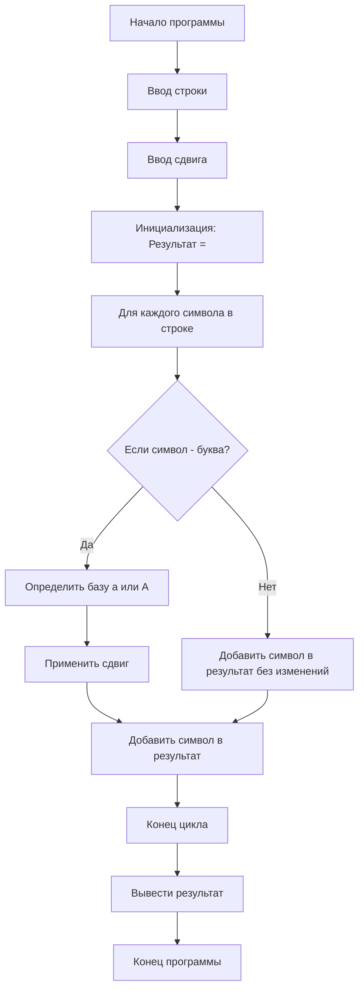
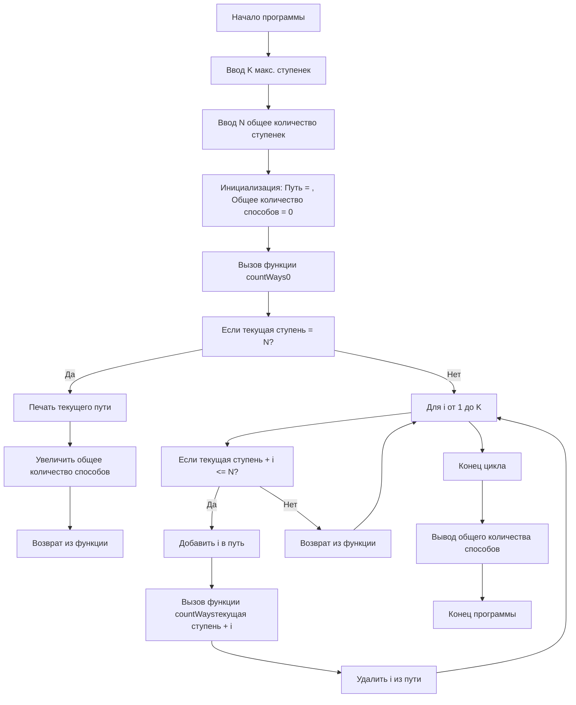

Алгоритм
Задание 1

### Алгоритм шифра Цезаря

1. **Ввод данных**:
    
    - Запросить у пользователя строку для шифрования.
    - Запросить у пользователя количество символов для сдвига.
2. **Инициализация**:
    
    - Создать пустую строку для хранения результата.
3. **Обработка каждого символа строки**:
    
    - Для каждого символа в строке:
        - Если символ является буквой:
            - Определить базу (для строчных букв - 'a', для прописных - 'A').
            - Применить сдвиг, учитывая цикличность (используя модуль 26).
            - Добавить зашифрованный символ в результирующую строку.
        - Если символ не является буквой, добавить его в результирующую строку без изменений.
4. **Вывод результата**:
    
    - Вывести зашифрованное сообщение.

### Блок-схема




![[Pasted image 20250228091717.png]]
```
#include <iostream>
#include <string>

std::string caesarCipher(const std::string& text, int shift) {
    std::string result = "";

    for (char c : text) {
        if (isalpha(c)) {
            char base = islower(c) ? 'a' : 'A';
            // Применяем сдвиг с учетом цикличности
            c = (c - base + shift) % 26 + base;
        }
        result += c;
    }

    return result;
}

int main() {
    system ("chcp 1251");
    std::string input;
    int shift;

    std::cout << "Введите фразу для шифрования: ";
    std::getline(std::cin, input);
    std::cout << "Введите количество символов для сдвига: ";
    std::cin >> shift;

    std::string encrypted = caesarCipher(input, shift);
    std::cout << "Зашифрованное сообщение: " << encrypted << std::endl;

    return 0;
}
```
Задание 2

### Алгоритм для подсчета способов добраться до вершины лестницы

1. **Ввод данных**:
    
    - Запросить у пользователя максимальное количество ступенек (K), которое заяц может преодолеть за один прыжок.
    - Запросить у пользователя общее количество ступенек (N) в лестнице.
2. **Инициализация**:
    
    - Создать пустой вектор `path` для хранения текущего пути.
    - Инициализировать переменную `totalWays` для хранения общего количества способов, равной 0.
3. **Определение функции `countWays(currentStep)`**:
    
    - Если `currentStep` равно `N`:
        - Печать текущего пути.
        - Увеличить `totalWays` на 1.
        - Вернуться из функции.
    - Для каждого `i` от 1 до `K`:
        - Если `currentStep + i` меньше или равно `N`:
            - Добавить `i` в `path`.
            - Вызвать `countWays(currentStep + i)`.
            - Удалить `i` из `path` (возврат назад).
4. **Вызов функции**:
    
    - Вызвать `countWays(0)` для начала подсчета с первой ступеньки.
5. **Вывод результата**:
    
    - Вывести общее количество способов, хранящееся в `totalWays`.
6. **Конец программы**.




![[Pasted image 20250228092337.png]]
```
#include <iostream>
#include <vector>

void countWays(int K, int N, std::vector<int>& path, int currentStep, int& totalWays) {
    if (currentStep == N) {
        // Печатаем текущий путь
        for (size_t i = 0; i < path.size(); ++i) {
            std::cout << path[i];
            if (i < path.size() - 1) std::cout << "+";
        }
        std::cout << std::endl;
        totalWays++; // Увеличиваем количество способов
        return;
    }

    for (int i = 1; i <= K; ++i) {
        if (currentStep + i <= N) {
            path.push_back(i);
            countWays(K, N, path, currentStep + i, totalWays);
            path.pop_back(); // Возвращаемся назад
        }
    }
}

int main() {
    int K, N;
    std::cout << "Введите максимальное количество ступенек (K): ";
    std::cin >> K;
    std::cout << "Введите общее количество ступенек (N): ";
    std::cin >> N;

    std::vector<int> path; // Для хранения текущего пути
    int totalWays = 0; // Для хранения количества способов

    std::cout << "Возможные маршруты:" << std::endl;
    countWays(K, N, path, 0, totalWays);

    std::cout << "Общее количество способов: " << totalWays << std::endl;

    return 0;
}
```
