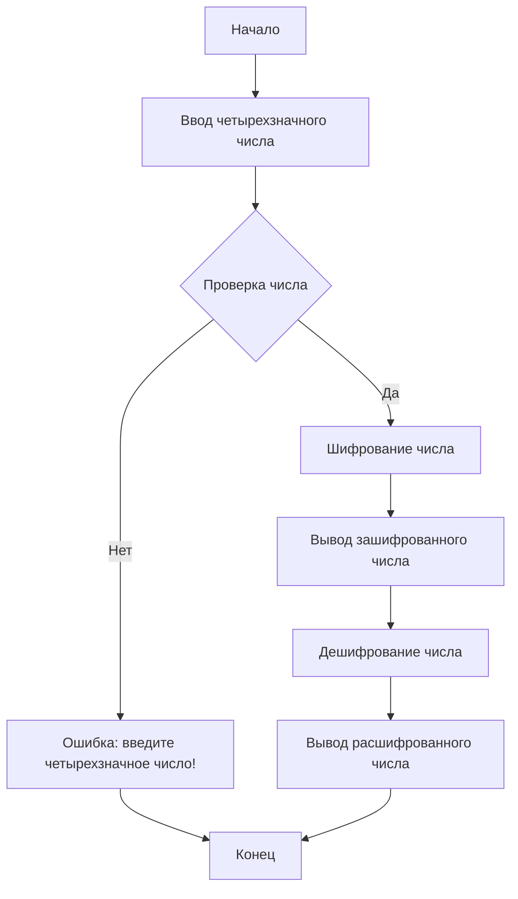
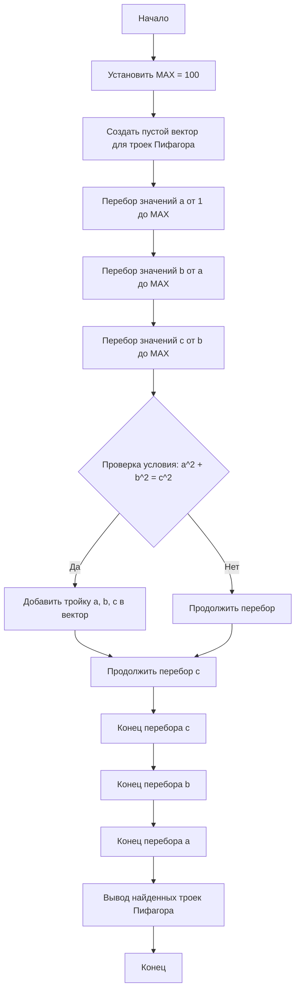
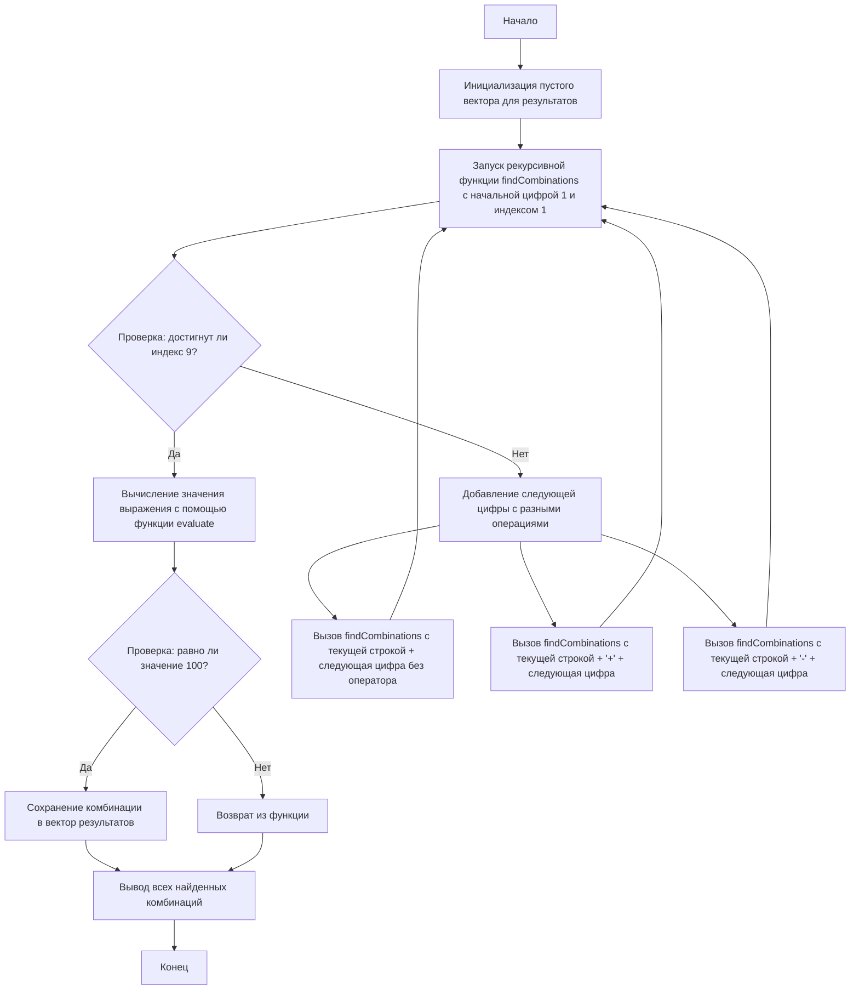
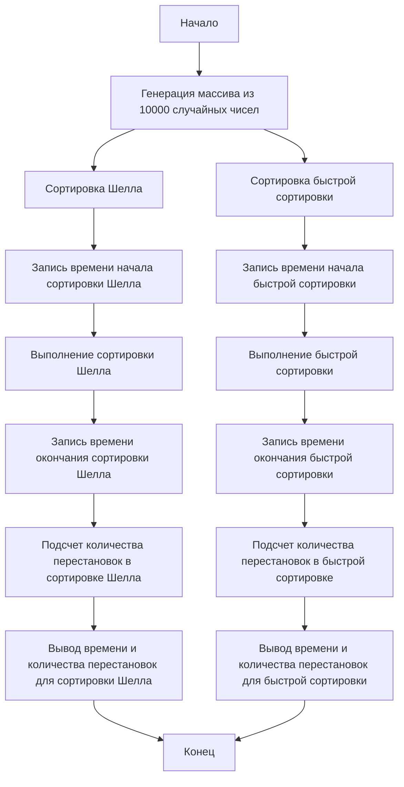

## Задача 1

![[Pasted image 20250307093243.png]]

## Задача 2
![[Pasted image 20250307094616.png]]

## Задача 3

![[Pasted image 20250307094830.png]]

## Задача 4
![[Pasted image 20250307094322.png]]

